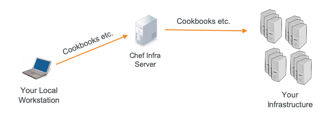

# Start Your Automation Journey

## 1.0 Key Objectives
- Define IT Automation
- List some of Chef Software's customers
- Explain what some Chef Automation products and solutions do
- Explain where Chef Software fits into DevSecOps

## 2.0 About Chef
| Feature | Remarks |
| :--- | :--- |
|Chef| Chef can automate you build, deploy and manage your infrastructure|
|Chef INFRA| First Product, 2008. Infrastructure automation to provision, harden and maintain configuration state.|
|Chef INSPEC| Security and Compliance automation in any environment, on any platform|
|Chef HABITAT| Automation capabilities for defining, packaging and delivering applications.|
|Chef COMPLIANCE| Compliance with Speed and Efficiency|
|Chef AUTOMATE| Provides operational visibility and organizational collaboration for everything you automate|

### What You Can Gain with With Chef Infra ?
> - Automate configuration management process
> - Applies updates dynamically, making conditional changes based on running environment or hardware
> - Ensure code portability among the development and production environment 
> - Make infrastructure configurations testable, portable and auditable


### What You Can Gain with With Chef Automate ? 
> - **Real-Time Data insights**: Configuration and compliance details are collected for every datacenter, cloud provider and environment managed by Chef Infra and the data is presented in aggregated dashboards that can be filtered
> - **Effortless collaboration** among Dev, Op, Security and Compliance teams 
> - Powerful Auditing Capabilities with **agent-less compliance scans** directly in the Web UI.
> - Intelligent Access Control using **LDAP/SAMP** to ensure the _right team having the right access_
> - Built-In Compliance Assets such as **CIS Benchmarks** (_Center for Internet Security_) and **DISA STIGs** (_Defense Information Systems Agency_, _Security Technical Implementation Guide_)

### What Chef Habitat Enables ?
> Chef Habitat enables DevOps and application teams to build continuous delivery pipelines across all applications and all change events.
> - By creating **artifacts** that can be deployed on-demand to bare-metal, VMs or containers without rewriting or refactoring of the underlying application code
> - thereby enabling the adoption of **agile** delivery practices across development and operations teams

> ### Chef App Delivery = Chef Habitat (Create artifact + agile delivery) + Chef Infra (to deploy immutable insfrasturcture) + Chef Automate (to gain application cluster visibility)

> ### Chef Compliance = Chef InSpec (For Auditing using CIS and STIG benchmarks) + Chef Habitat (for building Compliance Package, For Remediation on a control-by-control basis) + Chef Automate (For Monitoring & Reporting) 

### Chef Enterprise Automation Stack


** _[See Chef Enterprise Automation Stack](https://youtu.be/IBlNQR2nlEY)_


## 3.0 Environment Setup
### Step 3.1: Packages in Chef Workstation
Chef Workstation includes:
- **Chef Infra Client**: An agent &#8594; that runs locally on **every_node** under the management of Chef Infra Server.
- **Chef InSpec**: is a **Language** &#8594; for describing security & compliance rules &#8594; can be shared between *Software engineers, operations and Security Engineers.*
- **Chef Command Line Tool**: to apply dynamic, repeatable configuratios to your servers directly over **SSH** via **chef-run**. This provides a quick way to apply **config changes** to the systems you manage &#8594; whether of not the systems are being actively managed by **Chef Infra** &#8594; without require any preinstalled software
- **Test Kitchen**: can test cookbooks across any combination of platforms and test suites &#8594; Before you deploy those cookbooks to your *actual* **infrastructure nodes**
- Plus various **Test Kitchen** & **Knife plugins**

### Step 3.2: Install Chef Workstation Package
```bash
# Step-01: Install **Ruby**, I am doing this in my Ubuntu 18.04 environment
> sudo apt install ruby-full
> ruby --version 
ruby 2.5.8p224 (2020-03-31 revision 67882) [x86_64-linux-gnu]

# Step-02: Install **RubyMine** as IDE from Intellij

# Step-03: Download Chef-workstation and install
# This will be installed in /opt/chef-workstation/ directory
> curl https://omnitruck.chef.io/install.sh | sudo bash -s -- -P inspec

# Check the **chef** version installed
> chef --version
Chef Workstation version: 21.8.555
Chef Infra Client version: 17.3.48   # This is the chef version
Chef InSpec version: 4.38.9
Chef CLI version: 5.4.1
Chef Habitat version: 1.6.351
Test Kitchen version: 3.0.0
Cookstyle version: 7.15.4
```

## 4.0 Sample Scenarios
### 4.1 Chef Infra
#### A. Scenario 01: When happens when user pushes cookbooks into Chef Infra Server
> User is uploading a set of chef cookbooks to the chef infra server.

> Chef Cookbooks: is a set of configuration files, called **recipes** &#8594; responsible for instantiate, configure and maintain your infrastructure nodes in an automated fashion (physical/virtual).

> The Chef Infra server in turn loads those cookbooks to the correct nodes.

> 

#### B. What a Chef Cookbook looks like
```bash
├── cookbooks  # (set of configuration files)
│   ├── myapp
│   │   ├── attributes                # <-- Note
│   │   │   └── default.rb            # <-- Note
│   │   ├── CHANGELOG.md
│   │   ├── chefignore
│   │   ├── .kitchen.yml              # <-- Most Important      
│   │   ├── LICENSE
│   │   ├── metadata.rb               # <-- Note
│   │   ├── Policyfile.rb             # <-- Note
│   │   ├── README.md
│   │   ├── recipes                   # <-- Note
│   │   │   └── default.rb            # <-- Note
```
#### C. Example 01: Webserver install, enable and start
> Create a recipe **cookbooks/hardening/recipe/remediation.rb** which will install the httpd package if it is not installed earlier.
> - Install an Apache Web Server package (httpd)
> - Create a file on that node called **/var/www/html/index.html**
> - enable and start the Apache web server
```ruby
# install the apache package named 'httpd'
package 'httpd'

# load the index.html.erb template under the cookbook into /var/www/html/index.html
template '/var/www/html/index.html' do
  source 'index.html.erb' # this is under the cookbooks/cookBookName/template directory
end

# Enable and Start the httpd service
service 'httpd' do
  action [:enable, :start]
end
```

### 4.2 Chef InSpec
#### What a Chef InSpec looks like ?
```bash
aws-security/                 # The InSpec Profile, Create a skeleton profile: inspec init profile <name>
├── controls                  # Write all your controls here
│   └── example.rb            # <-- Note
├── files
│   └── terraform.json        # <-- Note
├── inputs.yml
├── inspec.lock
├── inspec.yml                # <-- Note
└── README.md


```


#### A. Scenario 01: Test a node for security Compliance
> In this example, **Inspect** is testing the node 
> - to ensure the **ssh_config** protocol should be 2. 
> - If the actual value frm the node is _not_ protocol 2, a **critical** issue is reported and can be displayed in the **Chef Automate** UI as shown below.


```ruby
# Source Code
control 'ssh-04' do                             # unique control name
  impact 1.0                                    # Impact : {0.0 to 1.0}, 1.0 --> critical, anything above 0.7+ is reported in Chef Automate UI
  title 'Cleint: Specify protocol version 2'    # Give it a title
  desc "Only SSH protocol  v2 conn is permitted, V1 not permitted" # additional description
  describe ssh_config do                        # describe <InSpec Resource Name>
    its('Protocol'){should eq('2')}             # its{<resource_feature>}, used to validate of one your resource feature
  end                                             # eq --> is a matcher, like cmp
end
```

#### B. Scenario 02
> In this example **InSpec** will check to see if the /tmp directory is owned by the root user. 
> If the the _/tmp_ directory is out of policy, the output from deploying the profile will produce an error, 
> which can be visualized and monitored using the dashboard and visibility tool Chef Automate.

```ruby
# Source Code
control 'tmp-1.1' do
  impact 0.3
  title '/tmp directory is owned by the root user'
  desc 'The /tmp directory is owned by the root used'
  describe file('/tmp') do
    it {should be_owned_by 'root'}
  end
end
```

### 4.3 Chef Habitat
#### A. Scenario 01:
Under the /root/sample-habitat, create a 2X habitat plan (one is default and other named imagemagick ). Then check the structure of these habitate file.

> **Note**: Under any habitate file **plan.sh**. The purpose of **Chef Habitat** to reduce the misunderstanding between developers and operators about how an app is built or deployed with a single-source-of-truth.
> This patterns makes combining Habitat with other automation tools like **Chef Infra** and **InSpec**.

#### Source Code
```bash
# Source Code
> cd /tmp
> mkdir sample-habitat
> cd sample-habitat

# Create the default Habitat Plan
> hab plan init       # this will create a plan named habitat

# Create the next Habitat Plan named 'imagemagick'
> hab plan init imagemagick

# Check the structure of these habitat plans
> tree
.
├── habitat
│   ├── config        # (a directory, may contains the config files i.e. httpd.conf)
│   ├── default.toml  # (a file, contains the config file variable infos)
│   ├── hooks         # (a directory, contains init.sh as bash automation script run at target)
│   ├── plan.sh       # (this is the main file, which contains all dependencies and others)
│   └── README.md
└── imagemagick
    ├── config
    ├── default.toml
    ├── hooks
    ├── plan.sh
    └── README.md
    
# Now Enter into the Hab studio and try yo run the 'build'
> hab studio enter
  > [1][default:/src:0]# build # this will create a artifact files with .HART externsion under /src/results directory
  
  : Loading /src/plan.sh  # See, its loading the plan.sh file and building from it
   sample-habitat: Plan loaded
   sample-habitat: Validating plan metadata
  

```
#### Glimps of plan.sh file
```bash
# Have a glimps of habitat/plan.sh file
> head -n 10 habitat/plan.sh
pkg_name=meme-machine
pkg_origin=learnchef_tryhabitat
pkg_version="0.2.0"
pkg_scaffolding="core/scaffolding-ruby"
pkg_deps=(
  learnchef_tryhabitat/imagemagick
)
  
# Have a glimps of habitat/config/httpd.conf file
# Skipped with bravity
```

#### Glimps of default.toml 
```bash
# Glimps of habitat/default.toml file
> cat habitat/default.toml
#httpd.conf settings
serveradmin = "you@example.com"
servername = "localhost"
serverport = "80"
listen = ["80"]
user = "hab"
group = "hab"
default_modules = [	"access_compat", "alias", "auth_basic", "authn_file", "authn_core", "authz_host",
                    "authz_groupfile", "authz_user", "autoindex", "cgid", "dir", "env", "filter",
                    "headers", "log_config", "mime", "reqtimeout", "rewrite", "setenvif", "ssl", "status", "version" ]

#httpd-default settings
timeout = 60
keepalive = "On"
keepaliverequests = 100
keepalivetimeout = 5
serversignature = "Off"
servertokens = "Full"
accessfilename = ".htaccess"
canonicalname = "Off"
hostnamelookups = "Off"
...
```

#### Glimps of hooks/init file
```bash
# Have a glimps of habitat/hooks/init file
> cat habitat/hooks/init
#!/bin/bash

addgroup {{cfg.group}}
adduser --disabled-password --ingroup {{cfg.user}} {{cfg.group}}

chmod 755 {{pkg.svc_data_path}}

mkdir -p {{pkg.svc_data_path}}/htdocs

mkdir -p {{pkg.svc_data_path}}/cgi-bin
cp {{pkg.path}}/hello-world  {{pkg.svc_data_path}}/cgi-bin/

chmod 755 {{pkg.svc_data_path}}/cgi-bin/hello-world
```

