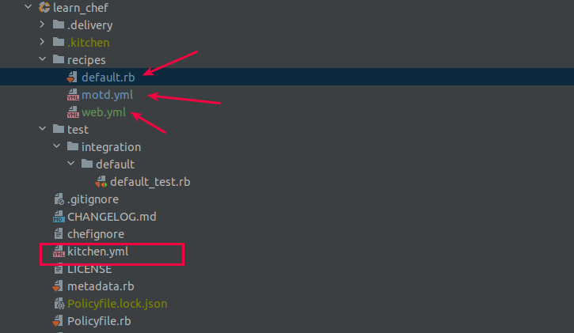

# Lab 02: Learn Chef Infra
## Experiment Name:
#### Prepare a cookbook to deploy two Test instances ( 1X Ubutnu 18.04 and 1X Centos-8) using Kitchen.yml and converging the changes into these in a agile process.

> #### Key Commands we will use
> - **chef generate cookbook <CookBook_Name>**: To generate a cookbook
> - **kitchen list**: to see the status of TestInstances
> - **kitchen create**: to create all the test instance
> - **kitchen create <TestInstance_Name>** : to create only a specific TestInstance
> - **kitchen converge** : To push the updates into TestInstances
> - **kitchen converge <TestInstance_Name>**: To push the updates only to a specific TestInstance
> - **kitchen destroy**: To destroy all the TestInstances created earlier
> - **kitchen destroy <TestInstance_Name>**: to destroy only to a specific TestInstance created earlier

> #### Chef Infra Structure at a glance



## PART-01: Environment setup and generating cookbook
### 1.1 Install Chef and check the chef version
```bash
# Install Chef
> curl https://omnitruck.chef.io/install.sh | sudo bash -s -- -P inspec

# Check the chef version and identify the current chef Infra version
> chef --verison
Chef Workstation version: 21.8.555
Chef Infra Client version: 17.3.48 # <--- NOTE
Chef InSpec version: 4.38.9
Chef CLI version: 5.4.1
Chef Habitat version: 1.6.351
Test Kitchen version: 3.0.0
Cookstyle version: 7.15.4
```

### 1.2 Generate a cookbook named 'learn_chef'  and check its structure
```bash
# Generate the cookbook named 'learn_chef'
> chef generate cookbook learn_chef

# Check the cookbook structure
> tree learn_chef
learn_chef/
├── CHANGELOG.md
├── chefignore
├── kitchen.yml     # <-- We will now inspect it and try to understand its structure
├── LICENSE
├── metadata.rb
├── Policyfile.rb
├── README.md
├── recipes
│   └── default.rb
└── test
    └── integration
        └── default
            └── default_test.rb

```

### 1.3 Understand the kitchen.yml
```bash
# Test Kitcehn was built to use several different flexible settings
# This kitchen.yml is a combinaiton of several key-value pairs
# Lets see the newly originated kitchen.yml file
# What this file do? - this file instructs Test Kitchen to use Vagrant to create two instances
# One Ubuntu and one CentOS and then use Chef Infra to provision the test instances 

> cd learn_chef
> cat kitchen.yml
....
driver:             # here this instance will load with vagrant in virtualBox
  name: vagrant     # However, this could be docker too, in that case the name would be 'dokken' with provider 'chef'

provisioner:        # this tool execute the suites against the test instance(s)
  name: chef_zero   # 

verifier:
  name: inspec

platforms:          # OS or target environment(s) on which your policies are to be tested
  - name: ubuntu-20.04  # Target/Test Instance 01 from **bento** repo maintained by Chef
  - name: centos-8      # Target/test Instance 02 from **bento** repo 

suites:             # The policies and code which will be enforces on the test instance(s)
  - name: default   # test/integration/default/default_test.rb
    verifier:
      inspec_tests:
        - test/integration/default
    attributes:
```

### 1.4 Check the kitchen list to see whether the target instances are provisioned or not
```bash
# Check the kitchen list
# Mote: See the Target OS is yet to provision with last action _<Not Created>_
> kitchen list
....
Instance             Driver   Provisioner  Verifier  Transport  Last Action    Last Error
default-ubuntu-2004  Vagrant  ChefInfra    Inspec    Ssh        <Not Created>  <None>
default-centos-8     Vagrant  ChefInfra    Inspec    Ssh        <Not Created>  <None>
```

### 1.5 Create Test Instances using _kitchen create_ command and check the kitchen list after creattion
```bash
# Create the Target/test instances (2x: Ubuntu + Centos)
> kitchen create

-----> Starting Test Kitchen (v3.0.0)
-----> Creating <default-ubuntu-2004>...
       Bringing machine 'default' up with 'virtualbox' provider...
       ...
-----> Creating <default-centos-8>...
       Bringing machine 'default' up with 'virtualbox' provider...
       ==> default: Importing base box 'bento/centos-8'...

# Check the kitchen list again
> kitchen list 
Instance             Driver   Provisioner  Verifier  Transport  Last Action  Last Error
default-ubuntu-2004  Vagrant  ChefInfra    Inspec    Ssh        Created      <None>
default-centos-8     Vagrant  ChefInfra    Inspec    Ssh        Created      <None>
# ** See the 2X Test instances are <created>

# Now, test whether the newly created Test Instances are accessible
> kitchen login centos
> kitchen login ubuntu
```

## PART 02: Writing infra code and deploying the changes
### 2.1 Create a /etc/motd file with content "Learning Chef is fun with YAML!" for both Test Instances and verify at login 
#### 2.1.1 Create a ~/etc/motd file in both the Target/Test instances
> **Note:**
> - Infra resource will be used: **file**
> - file need to be created : /etc/motd
> - Target Instances: centos, ubuntu
> - Where to write this? - in **recipe/learn-chef.yml**
> - learn-chef.yml is a newly created recipe
> - recipe can be written both in Ruby or YML

```bash
# Create a new recipe named recipe/motd.yml
> vim recipe/motd.yml
---
resources:
  - type: "file"                # resource 01: To create the file
    name: "/etc/motd"
    content: "Learning Chef is fun with YAML!"
    
# But kitchen will only look for the recipe written in recipe/default.rb
# So, include our newly created recipe/motd.yml into recipe/default.rb
> vim recipe/default.rb
---
include_recipe "learn_chef::motd"  # include_recipe "<cookbook_name::recipe_name>"
```

#### 2.1.2 Deploy the changes in Test Instances using **kitchen converge**
```bash
# Deploy the changes in Test Instances
> kitchen converge
---
-----> Starting Test Kitchen (v3.0.0)
-----> Converging <default-ubuntu-2004>...
       Preparing files for transfer
-----> Converging <default-centos-8>...
       Preparing files for transfer

# Check the Test instance status (converged or not??)
> kitchen list 
Instance             Driver   Provisioner  Verifier  Transport  Last Action  Last Error
default-ubuntu-2004  Vagrant  ChefInfra    Inspec    Ssh        Converged    <None>
default-centos-8     Vagrant  ChefInfra    Inspec    Ssh        Converged    <None>
# ** See, both instances are converged with the changes

# Check whether the new motd message shown at Test Instance login
> kitchen login centos
Learning Chef is fun with YAML!                   # New /etc/motd message
Last login: Thu Aug 26 10:46:44 2021 from 10.0.2.2

> kitchen login ubuntu
Learning Chef is fun with YAML!                   # New /etc/motd message
Last login: Thu Aug 26 10:46:33 2021 from 10.0.2.2
```

### 2.2: Configure a Apache2 Web Server Only for TestInstance::Ubuntu
#### 2.2.1 Create a new recipe named recipe/web.yml
```bash
# Create a new recipe named recipe/web.yml
# This recipe will use 3x resources: 
# a. package (to install the apache2 package)
# b. file (to create the /var/www/html/index.html file)
# c. service (to enable and start the apache2 service)
# ** Note: apache2 package is not applicable for centos, for centos we need "httpd" package
> vim recipe/web.yml
---
resources:
  - type: "package"           # resource 01: To install the package
    name: "apache2"

  - type: "file"              # resource 02: To create the file
    name: "/var/www/html/index.html"
    content: "Sample Ubuntu Web Server deployed using Chef Infra::Kitchen"

  - type: "service"           # resource 03: To enable and start the service
    name: "apache2"
    action:
      - enable
      - start

# Add the newly created recipe/web.yml into recipe/default.rb
> vim recipe/default.rb
---
include_recipe "learn_chef::web"
```

#### 2.2.2 Deploy the changes in Test Instance (Ubuntu) using **kitchen converge**
```bash
# Deploy the changes into TestInstance:: Ubuntu
> kitchen converge ubuntu
---
-----> Starting Test Kitchen (v3.0.0)
-----> Converging <default-ubuntu-2004>...
... (Skipped)
Converging 4 resources
       Recipe: learn_chef::motd
         * file[/etc/motd] action create (up to date)
       Recipe: learn_chef::web
         * apt_package[apache2] action install
           - install version 2.4.41-4ubuntu3.4 of package apache2
         * file[/var/www/html/index.html] action create
           - update content in file /var/www/html/index.html from b66332 to 6d267e
           --- /var/www/html/index.html	2021-08-26 11:10:47.050262637 +0000
           +++ /var/www/html/.chef-index20210826-13456-cb1g6k.html
           ... (Skipped)
          * service[apache2] action enable (up to date)
          * service[apache2] action start (up to date)

# Check the Test Instance Status
> kitchen list

# Verify whether the apache2 webserver is running in TestInstance::Ubuntu
> kitchen login ubuntu
vagrant@default-ubuntu-2004:~$ curl localhost
---
Sample Ubuntu Web Server deployed using Chef Infra::Kitchen
```
## Mission accomplished! You've not only configured an Apache web server
> ### Lesson Learned:
> - You learned what Chef resources are!
> - You learned what Chef recipes are!
> - You learned how to use Chef recipes and resources to configure a server from scratch!

## PART 03: Cleanup and exit
```bash
# Destroy all the TestInstances created
> kitchen destroy
---
-----> Starting Test Kitchen (v3.0.0)
-----> Destroying <default-ubuntu-2004>...
       ==> default: Forcing shutdown of VM...
-----> Destroying <default-centos-8>...
       ==> default: Forcing shutdown of VM...
       ==> default: Destroying VM and associated drives...

# check the Kitchen list again, this time you will see Test Instances <Not Created>
> kitchen list
Instance             Driver   Provisioner  Verifier  Transport  Last Action    Last Error
default-ubuntu-2004  Vagrant  ChefInfra    Inspec    Ssh        <Not Created>  <None>
default-centos-8     Vagrant  ChefInfra    Inspec    Ssh        <Not Created>  <None>
```