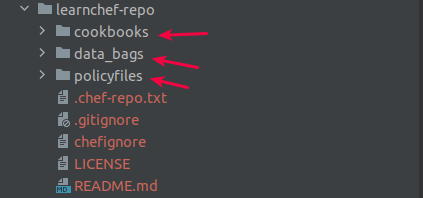

# Lab 03
## Experiment Name: Create a basic Chef repo and try to understand its architecture


### Objective:
- To learn more about the **chef generate** command used in Lab 02
- To learn about **chef run** and **chef-client**  commands --> which allow you to execute Chef Infra code on the systems you're managing
- To learn about a tool called knife --> a command-line tool that provides an interface between your local Chef Infra code and the Chef Infra Server that manages all the moving parts of your Chef ecosystem
- To learn about Chef Infra Server service within Chef Automate to eventually scale out the use of Chef infra cookbooks to your entire infrastructure.

`chef generate` `chef run` `chef-client` `knife` `chef automate`

> ### Recall the Chef cookbook structure
> 

> ### What a Chef Repositoy looks like?
> Chef repository is a collection of Chef cookbooks, policyfiles and data_bags. So in summary we can write:
`Chef Repository = cookbooks + policyfiles + data_bags` 
> - **cookbooks** = collection of different cookbook which includes recipes, attributes, kitchen.yml file etc
> - **data_bags** = to store any secrets and keys those could be used to manage your environments
> - **policyfiles** = is a collection of different policies. This is used to keep your overreaching policies in place.
> 

> ### A glimps of knife
> With knife, you can create distinct profiles that allow you to quickly and easily switch from interacting with one Infra Server to another Infra Server 
>
> #### knife helps you manage and maintain:
> - Nodes
> - Cookbooks and recipes
> - The enforcement of Policies
> - Resources within various cloud environments
> - The installation of Chef Infra Client onto nodes
> - Searching of indexed data about your infrastructure
> 
> *** _To see knife in action: you need a Chef Infra Server for knife to interact with._

> **Some useful knife commands**
> 
> **A**. **knife bootstrap**
> - allows you to iniitiate a process that installs Chef Infra Client on the target system and
> - configures the Infra Client to be able to communicate with Infra Server.
> - It registers the target system as **node** on the Infra Server, 
> - thus allowing the Infra Server to manage which and when policies are enforced, and thus automating your infrastructure management
```bash
# Some useful knife bootstrap commands
** BOOTSTRAP COMMANDS **
knife bootstrap [PROTOCOL://][USER@]FQDN (options)
knife bootstrap azurerm SERVER (options)
Usage: /usr/bin/knife (options)
knife bootstrap windows ssh FQDN (options) DEPRECATED
knife bootstrap windows winrm FQDN (options) DEPRECATED
```

> **B**: **knife node**
> - knife bootstrap command registers the target system as a node on the Infra Server.
> - Once the target system is registered, the knife node command allow you to update the policies on any one or more of your managed nodes.
```bash
# Some useful knife node commands
** NODE COMMANDS **
knife node bulk delete REGEX (options)
knife node create NODE (options)
knife node delete [NODE [NODE]] (options)
knife node edit NODE (options)
knife node environment set NODE ENVIRONMENT
knife node from file FILE (options)
knife node list (options)
knife node policy set NODE POLICY_GROUP POLICY_NAME (options)
knife node run_list add [NODE] [ENTRY [ENTRY]] (options)
knife node run_list remove [NODE] [ENTRY [ENTRY]] (options)
knife node run_list set NODE ENTRIES (options)
knife node show NODE (options)
```

> **C**: **knife ssh**
> - With all the Target systems are registered as node on the Infra Server, now you need to push
> - the policies (create/updates) into the nodes.
> - For that you need to connect the nodes remotely using knife ssh command. 
```bash
# Some useful knife ssh commands
** SSH COMMANDS **
knife ssh QUERY COMMAND (options)

```


### Step 01: Create a chef repo and understand the available commands in **chef generate**
#### 1.1 Create a Chef Repository named 'learnchef-repo' to store all our chef code
```bash
# Create a chef repository named 'learnchef-repo'
> cd ~
> chef generate repo learnchef-repo
---
Generating Chef Infra repo learnchef-repo
- Ensuring correct Chef Infra repo file content


# Check the structure of this newly generated chef repo
> tree learncehf-repo
---
learnchef-repo/
├── chefignore
├── cookbooks                     # 01. Cookbooks = Collection of different cookbook
│   ├── example
│   │   ├── attributes
│   │   │   └── default.rb
│   │   ├── metadata.rb
│   │   ├── README.md
│   │   └── recipes
│   │       └── default.rb
│   └── README.md
├── data_bags                     # 02. data_bags = to store any secrets and keys those could be used to manage your environments
│   ├── example
│   │   └── example_item.json
│   └── README.md
├── LICENSE
├── policyfiles                   #9 03. policyfiles = is a collection of different policies. This is used to keep your overreaching policies in place.
│   └── README.md
└── README.md
```

#### 1.2 Get the list of all chef generate commands
```bash
# Try chef generate --help
> chef generate --help
---
Available generators:
  cookbook        Generate a single cookbook    # chef generate cookbook <cookBookName>, chef generate cookbook <cookbookName> -P // here -P means generate with a default policyfile.rb
  recipe          Generate a new recipe         # chef generate cookbook/recipe <recipeName>
  attribute       Generate an attributes file   # chef generate attribute cookbookName <attributeFileName>
  template        Generate a file template      # chef generate cookbook/template <templateName>
  file            Generate a cookbook file      # chef generate cookbook/file <fileName>
  resource        Generate a custom resource    
  repo            Generate a Chef Infra code 
                  repository                    # chef generate repo <repoName>
  policyfile      Generate a Policyfile for     # Example: chef install cookbooks/base/Policyfile.rb
                  use with the install/push 
                  commands                      #
  generator       Copy Chef Workstation's generator cookbook so you can customize it

```

### Step 02: Deep Drive into a Policy file
```bash
> vim cookbookName/Policyfile.rb
---
# Policyfile.rb - Describe how you want Chef Infra Client to build your system.
# A name that describes what the system you're building with Chef does.
name 'learn_chef'                 # the name of the cookBook

# Where to find external cookbooks:
default_source :supermarket       # the default source to find the external cookbooks are from "supermarket"

# run_list: chef-client will run these recipes in the order specified.
run_list 'cookbookName::default'  # the default recipe which the chef-client will run in the Target Node

# Specify a custom source for a single cookbook:
cookbook 'cookbookName', path: '.'  # Path of the cookbook
```


