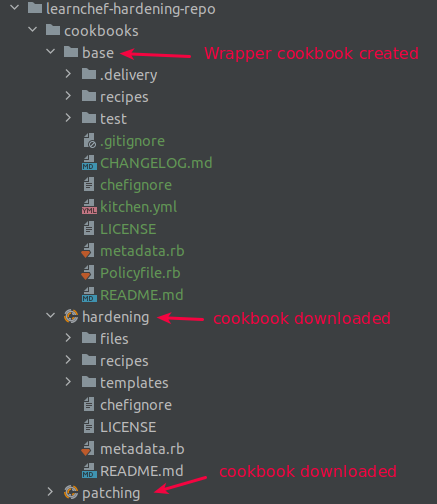
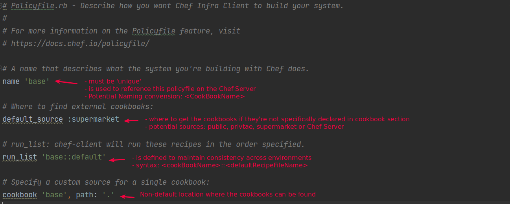
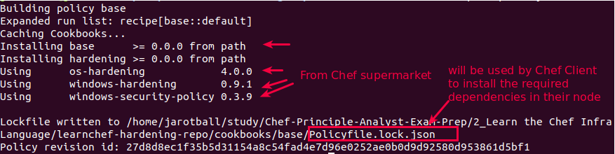
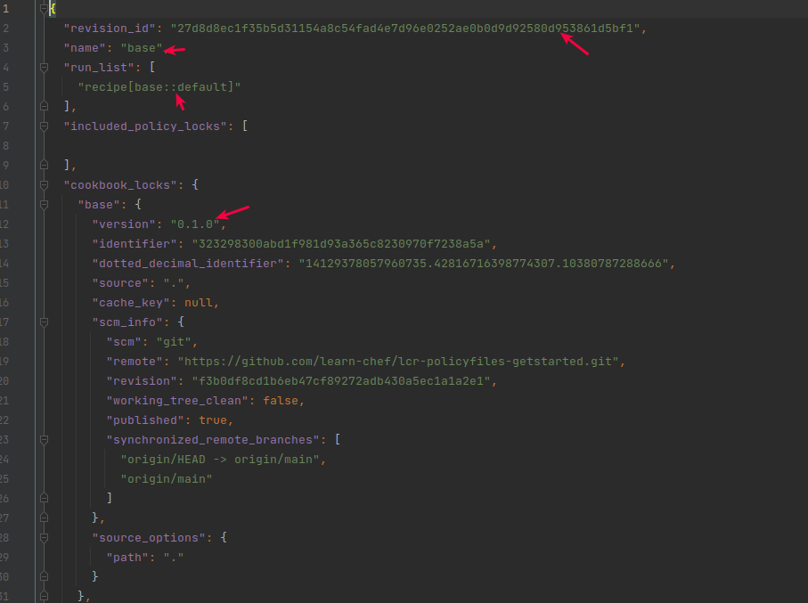
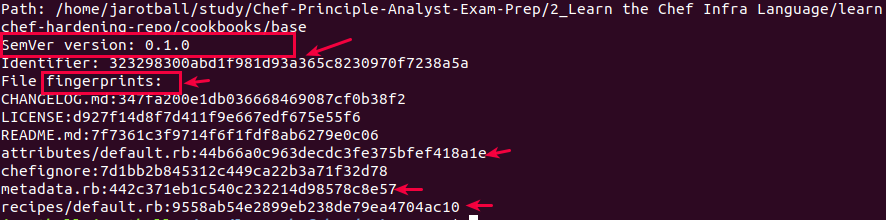
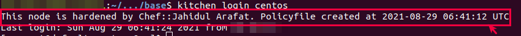

# Lab 04
## Experiment Name: Demonstrating a Hardening Cookbook 
## Learning Objective:
- To run the hardening cookbook to ensure our machine remain compliant
- To create a wrapper cookbook named 'base' with a default policyfile into it

### Step 01: Create a cookbook and testing it with Test Kitchen
```bash
# 3.1 Clone a pre-existing hardening repo from github
> git clone https://github.com/learn-chef/lcr-policyfiles-getstarted.git

# 3.2 Rename the cloned repository to learnchef-hardening-repo
> mv lcr-policyfiles-getstarted/ learnchef-hardening-repo

# 3.2 Explore its tree structure
> tree learnchef-hardening-repo
---
learnchef-hardening-repo
├── chefignore
├── cookbooks                               # 2x cookbook (hardening, patching):: I will add another cookbook here
│   ├── hardening                     # Cookbook 01: hardening :: downloaded with cloned git repo
│   │   ├── chefignore
│   │   ├── files
│   │   │   └── default
│   │   │       └── auditd.conf
│   │   ├── LICENSE
│   │   ├── metadata.rb
│   │   ├── README.md
│   │   ├── recipes
│   │   │   ├── default.rb
│   │   │   └── remediation.rb
│   │   └── templates
│   │       └── default
│   │           └── filesystem_blacklisting.erb
│   ├── patching                      # Cookbook 02: patching :: downloaded with cloned git repo
│   │   ├── attributes
│   │   │   └── default.rb
│   │   ├── chefignore
│   │   ├── LICENSE
│   │   ├── metadata.rb
│   │   ├── README.md
│   │   └── recipes
│   │       └── default.rb
│   └── README.md
├── LICENSE
└── README.md
```

### Step 02: Create a wrapper cookbook 
```bash
# 2.1 Create a wrapper cookbook named "base" with a default policy file
> cd learnchef-hardening-repo
> chef generate cookbook cookbooks/base -P
---
Generating cookbook base
- Ensuring correct cookbook content
...
If you'd prefer to dive right in, the default recipe can be found at:
recipes/default.rb
```


### Step 03: Add hardening cookbook into the base cookbook's default recipe
```bash
# 3.1 Add hardening cookbook into the base cookbook's default recipe
> vim cookbooks/base/recipes/default.rb
---
# Cookbook:: base
# Recipe:: default


include_recipe 'hardening::default'     # Hardening default recipe includes the following 2x recipes
                                        # include_recipe 'os-hardening::default'
                                        # include_recipe 'hardening::remediation'

# this motd will be displayed everytime system is login with ssh
# 2x attributes: ['base']['message'], its not create still now.
# So, try to create these two attributes using:: chef generate attribute <cookbookName> <attributFileName>
file '/etc/motd' do
  content node['base']['message']
end

# 3.2 Generate attributes for base cookbook with name :: default.rb and add 2x attributes ['base']['message'] into it
# Syntax:: chef generate attribute <cookBookName> <attributeFileName>
> chef generate attribute cookbooks/base default 
---
Recipe: code_generator::attribute
  * directory[cookbooks/base/attributes] action create              # A. attributes dir is created
    - create new directory cookbooks/base/attributes
  * template[cookbooks/base/attributes/default.rb] action create    # B. attributes/default.rb attributeFile is created
    - create new file cookbooks/base/attributes/default.rb

# 3.3 Add the above attributes into the newly generated attributes/default.rb
> vim cookbooks/base/attributes/default.rb
---
default['base']['message'] = "This node is hardened by Chef::Jahidul Arafat\n"

# 3.3 Hence, base cookbook depends on hardening cookbook, mention this dependency in base/metadata.rb
> vim cookbooks/base/metadata.rb
---
name 'base'
maintainer 'Jahidul Arafat'
maintainer_email 'jahidapon@gmail.com'
license 'All Rights Reserved'
description 'Installs/Configures base'
version '0.1.0'
chef_version '>= 16.0'  # B. This Chef version is critical, so always make sure your Chef version is >= of it
depends 'hardening'     # A. hardening cookbook is mentioned as dependency

# 3.4 (if you are curious:: optional):: check the dependencies in hardening/metadata.rb
> cat cookbooks/hardening/metadata.rb
---
depends 'os-hardening'        # Cookbook1: from chef supermarket: https://supermarket.chef.io/cookbooks/os-hardening
depends 'windows-hardening'   # Cookbook2: from chef supermarket: https://supermarket.chef.io/cookbooks/windows-hardening
```

### Step 04: What if the marketplace dependencies introduced in hardening cookbook changes
#### ** Thats the risk. So we need to lock that down to a specific version
#### ** the Policyfile.rb comes as rescue

#### 4.1 Deep Drive into Policyfile.rb
##### 


#### 4.2 Hence our wrapper cookbook "base" depends on cookbook::hardening, we have to mention that in base/Policyfile.rb
```bash
> vim cookbooks/base/Policyfile.rb
---
... (skipped)
cookbook 'hardening', path: '../hardening'    #adding the hardening cookbook which depends on cookbooks from chef supermarket
```

#### 4.3 Time to lock the Policyfile.rb and create a Policyfile.lock.josn
> - ** this **Policyfile.lock.json** --> is the actual policy used by Chef Client and having unique references of cookbooks in the run_list.
> - ** **Policyfile.rb** is used to create the related Policyfile.lock.json file
```bash
# 4.3.1  Install the base/Policyfile.rb to generate a Policyfile.lock.json
> chef install cookbooks/base/Policyfile.rb
```

```bash
# 4.3.2 Lets explore the Policyfile.lock.json
> cat cookbooks/base/Policyfile.lock.json
```


#### 4.4 When Chef-Client would return error as going through the Policyfile.lock.json
```bash
# 4.4.1 Check the cookbook's checksum
# If checksum version couldn't found, then Chef-Client will return an error
> chef describe-cookbook cookbooks/base
```



> ### Recap
> - A wrapper cookbook::base is created with default Policyfile using -P
> - cookbook::hardening recipe is included in cookbook::base default recipe
> - A motd file with 2x attributes is mentioned in base/recipe/default.rb
> - Attributes are created for cookbook::base using 'chef generate attribute cookbooks/base default'
> - In cookbboks/base/attributes/default.rb:: 2x attributes are created : ['base']['message']
> - in base/metadata.rb, depends 'hardeing' cookbook is mentioned
> - in base/Policyfile.rb, cookbook 'hardening', path: '../hardening' is mentioned
> - Then, base/Policyfile.rb is installed using 'chef install cookbooks/base/Policyfile.rb' command
> - and cookbooks/base checksum is inspected to ensure the Chef-client will not encounter any error while using Policyfile.lock.json

### Step 5.0 Test Your Code
```bash
# 5.1 cd to cookbooks/base and check the kitchen list
> cd cookbooks/base
> kitchen list
---
Instance             Driver   Provisioner  Verifier  Transport  Last Action    Last Error
default-ubuntu-2004  Vagrant  ChefInfra    Inspec    Ssh        <Not Created>  <None>
default-centos-8     Vagrant  ChefInfra    Inspec    Ssh        <Not Created>  <None>

# 5.2 Lets have a look at the kitchen.yml file 
> vim kitchen.yml
---
---
driver:
  name: vagrant # dokken, ec2, docker etc


provisioner:
  name: chef_zero

  ## product_name and product_version specifies a specific Chef product and version to install.
  ## see the Chef documentation for more details: https://docs.chef.io/workstation/config_yml_kitchen/
  #  product_name: chef
  #  product_version: 17

verifier:
  name: inspec

platforms:
  - name: ubuntu-20.04    # VM 01
  - name: centos-8        # VM 02


# See, no runlist is specified in suites.
# This is because, we used -P when generated wrapper cookbook::base with a default Policyfile.rb
# This Policyfile.rb later generated Policyfile.lock.json (when installed)
# For this reason, we didnt need to mention the runlist here as run_list is already mentioned in base/Policyfile.rb as 'base::default'
suites:
  - name: default         
    verifier:
      inspec_tests:
        - test/integration/default
    attributes:
    
# If you want to mention a custom defined Policyfile i.e. mypolicy.rb, then the suites will look like below
#suites:
#  - name: default
#    provisioner:
#      policyfile_path: mypolicy.rb       # <<--- Custom defined policyfile
#    verifier:
#      inspec_tests:
#        - test/integration/default
#    attributes:

# 5.2 Converge the kitchen::VM::Centos
> kitchen converge centos
---
 Converging <default-centos-8>...
       Preparing files for transfer
       Installing cookbooks for Policyfile ~/cookbooks/base/Policyfile.rb using `/usr/bin/chef-cli install`
       Installing cookbooks from lock #<-- Installing from Policyfile.lock.json using chef-cli
       Installing base                    0.1.0   #<--
       Installing hardening               0.1.0   #<--
       Using      os-hardening            4.0.0   #<--
       Using      windows-hardening       0.9.1   #<--
       Using      windows-security-policy 0.3.9   #<--
       Updating policy lock using `/usr/bin/chef-cli update`
       Building policy base
       Expanded run list: recipe[base::default]
       Caching Cookbooks...
       Installing base      >= 0.0.0 from path
       Installing hardening >= 0.0.0 from path
       Using      os-hardening            4.0.0
       Using      windows-hardening       0.9.1
       Using      windows-security-policy 0.3.9

> kitchen list
Instance             Driver   Provisioner  Verifier  Transport  Last Action    Last Error
default-ubuntu-2004  Vagrant  ChefInfra    Inspec    Ssh        <Not Created>  <None>
default-centos-8     Vagrant  ChefInfra    Inspec    Ssh        Converged      <None>

> kitchen login centos
---
This node is hardened by Chef::Jahidul Arafat  # See, the motd msg is loaded from cookbooks/base/attributes/default.rb

```

### Step 6.0 Overriding the attribute variables from Policyfile.rb | Adding Flexible Attributes
#### ** try to override the existing motd meessage with a new one 
```bash
# 6.1 Add the ['base']['message'] attributes in base/Policyfile.rb
# This will override the default attribute values in base/attributes/default.rb
> vim base/Policyfile.rb
---
default['base']['message'] = "This node is hardened by Chef::Jahidul Arafat. Policyfile created at #{Time.now.utc}\n"

# 6.2 update the base/Policyfile.rb
> chef update base/Policyfile.rb
---
Building policy base
Expanded run list: recipe[base::default]
Caching Cookbooks...
Installing base      >= 0.0.0 from path
Installing hardening >= 0.0.0 from path
Using      os-hardening            4.0.0
Using      windows-hardening       0.9.1
Using      windows-security-policy 0.3.9


# 6.3 Converge the changes in VM:Centos
> kitchen converge centos

# 6.4 Login to centos and see the updated motd message
> kitchen login centos
```


### Step 7.0 Cleanup
```bash
# 7.1 Destroy the kitchen
> cd base
> kitchen destroy
---
-----> Starting Test Kitchen (v3.0.0)
-----> Destroying <default-ubuntu-2004>...
       Finished destroying <default-ubuntu-2004> (0m0.00s).
-----> Destroying <default-centos-8>...
       ==> default: Forcing shutdown of VM...
       ==> default: Destroying VM and associated drives...
       Vagrant instance <default-centos-8> destroyed.
       Finished destroying <default-centos-8> (0m3.45s).
-----> Test Kitchen is finished. (0m3.95s)
```