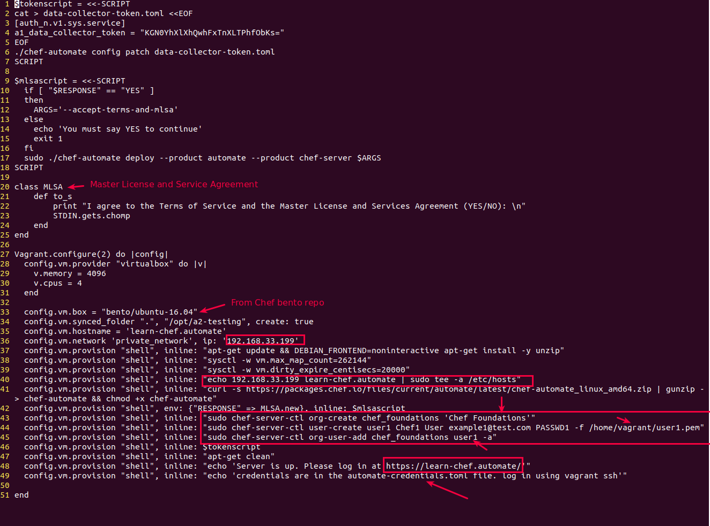
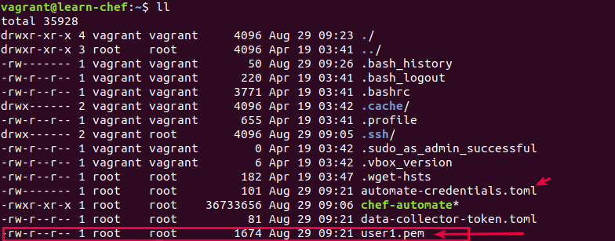
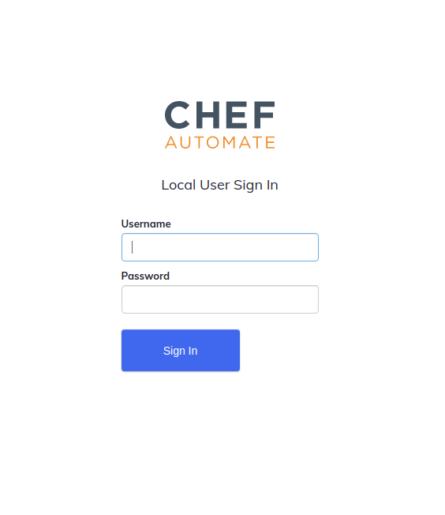
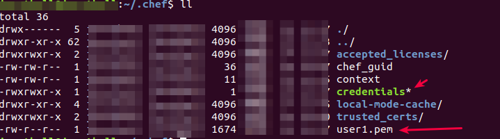

# Lab 05
## Experiment Name: XXXX
### Learning Objective:
- To learn about **knife profiles** :: is the ability to quickly and easily switch from one Chef Infra to another
- To configure **knife profiles** by adding them to **~/.chef/credentials** file @workstation (_TOML formatted_)
- To fetch the self signed certificate from Chef Infra Server to Host (My Machine)
- To make sure that knife at Host (My Machine) can coomunicate with Chef Infa Server (vagrant VM::Ubuntu16.04)

> ### Notes:
> - Chef Infra Server: Vagrant VM::Ubuntu 16.04
> - Chef Infra Server SSH port: 22
> - Host to Chef Infra Sever SSH Tunneling: 2222 ==> 22
- 
> ### A glimps of knife
> With knife, you can create distinct profiles that allow you to quickly and easily switch from interacting with one Infra Server to another Infra Server
>
> #### knife helps you manage and maintain:
> - Nodes
> - Cookbooks and recipes
> - The enforcement of Policies
> - Resources within various cloud environments
> - The installation of Chef Infra Client onto nodes
> - Searching of indexed data about your infrastructure
>
> *** _To see knife in action: you need a Chef Infra Server for knife to interact with._

> **Some useful knife commands**
>
> **A**. **knife bootstrap**
> - allows you to iniitiate a process that installs Chef Infra Client on the target system and
> - configures the Infra Client to be able to communicate with Infra Server.
> - It registers the target system as **node** on the Infra Server,
> - thus allowing the Infra Server to manage which and when policies are enforced, and thus automating your infrastructure management
```bash
# Some useful knife bootstrap commands
** BOOTSTRAP COMMANDS **
knife bootstrap [PROTOCOL://][USER@]FQDN (options)
knife bootstrap azurerm SERVER (options)
Usage: /usr/bin/knife (options)
knife bootstrap windows ssh FQDN (options) DEPRECATED
knife bootstrap windows winrm FQDN (options) DEPRECATED
```

> **B**: **knife node**
> - knife bootstrap command registers the target system as a node on the Infra Server.
> - Once the target system is registered, the knife node command allow you to update the policies on any one or more of your managed nodes.
```bash
# Some useful knife node commands
** NODE COMMANDS **
knife node bulk delete REGEX (options)
knife node create NODE (options)
knife node delete [NODE [NODE]] (options)
knife node edit NODE (options)
knife node environment set NODE ENVIRONMENT
knife node from file FILE (options)
knife node list (options)
knife node policy set NODE POLICY_GROUP POLICY_NAME (options)
knife node run_list add [NODE] [ENTRY [ENTRY]] (options)
knife node run_list remove [NODE] [ENTRY [ENTRY]] (options)
knife node run_list set NODE ENTRIES (options)
knife node show NODE (options)
```

> **C**: **knife ssh**
> - With all the Target systems are registered as node on the Infra Server, now you need to push
> - the policies (create/updates) into the nodes.
> - For that you need to connect the nodes remotely using knife ssh command.
```bash
# Some useful knife ssh commands
** SSH COMMANDS **
knife ssh QUERY COMMAND (options)

```

### Step 01: Check the chef version and create a khife repository
```bash
# 1.1 Check the chef version and make sure the version is >=16.0
> chef --version
---
Chef Workstation version: 21.8.555
Chef Infra Client version: 17.3.48  # Chef version
Chef InSpec version: 4.38.9
Chef CLI version: 5.4.1
Chef Habitat version: 1.6.351
Test Kitchen version: 3.0.0
Cookstyle version: 7.15.4

# 1.2 create a new directory named knife-repo where we will download a preconfigured Vagrant file
> mkdir knife-repo
> cd knife-repo

# 1.3 Create the Vagrant file
# this Vagrant file has a Ubuntu-16.04 configuration which will install Chef Automate server
# This VM will work as Chef-Infra Server
> vim Vagrantfile
---
$tokenscript = <<-SCRIPT
cat > data-collector-token.toml <<EOF
[auth_n.v1.sys.service]
a1_data_collector_token = "KGN0YhXlXhQwhFxTnXLTPhfObKs="
EOF
./chef-automate config patch data-collector-token.toml
SCRIPT

$mlsascript = <<-SCRIPT
  if [ "$RESPONSE" == "YES" ]
  then
    ARGS='--accept-terms-and-mlsa'
  else
    echo 'You must say YES to continue'
    exit 1
  fi
  sudo ./chef-automate deploy --product automate --product chef-server $ARGS
SCRIPT

class MLSA
  def to_s
    print "I agree to the Terms of Service and the Master License and Services Agreement (YES/NO): \n"
    STDIN.gets.chomp
  end
end

Vagrant.configure(2) do |config|
  config.vm.provider "hyperv" do |v|
    v.memory = 4096
    v.cpus = 4
  end

  config.vm.provider "virtualbox" do |v|
    v.memory = 4096
    v.cpus = 4
  end

  config.vm.box = "bento/ubuntu-16.04"
  config.vm.synced_folder ".", "/opt/a2-testing", disabled: true
  config.vm.hostname = 'learn-chef.automate'
  config.vm.network 'private_network', ip: '192.168.33.199'
  config.vm.provision "shell", inline: "apt-get update && DEBIAN_FRONTEND=noninteractive apt-get install -y unzip"
  config.vm.provision "shell", inline: "sysctl -w vm.max_map_count=262144"
  config.vm.provision "shell", inline: "sysctl -w vm.dirty_expire_centisecs=20000"
  config.vm.provision "shell", inline: "echo 192.168.33.199 learn-chef.automate | sudo tee -a /etc/hosts"
  config.vm.provision "shell", inline: "curl -s https://packages.chef.io/files/current/automate/latest/chef-automate_linux_amd64.zip | gunzip - > chef-automate && chmod +x chef-automate"
  config.vm.provision "shell", env: {"RESPONSE" => MLSA.new}, inline: $mlsascript
  config.vm.provision "shell", inline: "sudo chef-server-ctl org-create chef_foundations 'Chef Foundations'"
  config.vm.provision "shell", inline: "sudo chef-server-ctl user-create user1 Chef1 User example1@test.com PASSWD1 -f /home/vagrant/user1.pem"
  config.vm.provision "shell", inline: "sudo chef-server-ctl org-user-add chef_foundations user1 -a"   # here chef_foundation will be the knife-client at later part of this Lab
  config.vm.provision "shell", inline: $tokenscript
  config.vm.provision "shell", inline: "apt-get clean"
  config.vm.provision "shell", inline: "echo 'Server is up. Please log in at https://learn-chef.automate/'"
  config.vm.provision "shell", inline: "echo 'credentials are in the automate-credentials.toml file. log in using vagrant ssh'"
end
```


### Step 02: Check the vagrant status and create the VM using 'vagrant up' command
```bash
# 2.1 Create the VM using 'vagrant up' command
> cd knife-repo
> vagrant up 

# 2.2 Register the VM into /etc/hosts
> echo 192.168.33.199 learn-chef.automate | sudo tee -a /etc/hosts

# 2.3 Check the vagrant status
> vagrant status
---
Current machine states:
default                   running (virtualbox) # this machine will work as Chef-Infra server


# 2.4 Grep the vagrant host port
> vagrant port
---
22 (guest) => 2222 (host) # means my laptop  [Port:2222] connect to vagrant VM [port:22]
                          # host --> my laptop
                          # guest --> Vagrant VM

# 2.5 if you have earlier connected to port 2222, then remove that. Else there will be a signature invalidation
> ssh-keygen -f "/home/jarotball/.ssh/known_hosts" -R "[127.0.0.1]:2222"

# 2.6 Login to the vagrant VM and check whether user1.pem is created on not
> vagrant ssh
> ll
```


```bash
# 2.7 find the login credentials in automate-credentials.toml in vagrant VM
> vagrant ssh
> sudo cat automate-credentials.toml 
---
url = "https://learn-chef.automate"
username = "admin"
password = "a570648380368e8192e365ae2f7b0d7a"

# 2.8 Now login into the https://learn-chef.automate using these credentials
```


### Step 03: Copy the vagrant user1.pem to ~/.chef using scp and create a knife profile using this credential
```bash
# 3.1 Copy the vagrant user1.pem to ~/.chef using scp [password: vagrant]
> scp -P 2222 vagrant@127.0.0.1:/home/vagrant/user1.pem ~/.chef/user1.pem
---
The authenticity of host '[127.0.0.1]:2222 ([127.0.0.1]:2222)' can't be established.
ECDSA key fingerprint is SHA256:ZPJrRJczyJ/+XEfpBPYi8HbHqMoXgiOTugycwHPAmcQ.
Are you sure you want to continue connecting (yes/no)? yes
Warning: Permanently added '[127.0.0.1]:2222' (ECDSA) to the list of known hosts.
vagrant@127.0.0.1's password: 
user1.pem                                                                 100% 1674     3.9MB/s   00:00  

# 3.2 Confirm that your user1.pem file is in ~/.chef
> ll ~/.chef/
```

```bash
# 3.3 Create a knife profile 
> vim ~/.chef/credentails
---
[knife-profile-01-jarotball]
client_name = "user1"
client_key = "~/.chef/user1.pem"
chef_server_url = "https://learn-chef.automate/organizations/chef_foundations"

# 3.4 Make this the knife default profile
> knife config use-profile knife-profile-01-jarotball     # Set default profile to knife-profile-01-jarotball
```

### Step 4.0 Check whether knife (at host) can communicate with Chef Infra Server
```bash
# 4.1 Fetch the Self Signed certificate used in Chef-Infra-Server to /home/jarotball/.chef/trusted_certs
> knife ssl fetch
---
... (skipped)
Adding certificate for learn-chef_automate in /home/jarotball/.chef/trusted_certs/learn-chef_automate.crt

# 4.2 Check whether knife can communicate with Chef-Infra-Server
> knife client list         # return chef_foundations-validator :: syntax: <client_name>-<response>
```
# ** So we have successfully used a knife profile to configure knife to communicate with a Chef Infra Server.

### Step 5.0 [Optional] If you need to configure multiple knife profiles and switch between them from the host machine 
```bash
# 5.1 Configure 2 additional knife-profile named "[east-region]" and "[west-region]"
> vim ~/.chef/credentials
---
... (skipped)
[east-region]
client_name = "user1"
client_key = "~/.chef/user1.pem"
chef_server_url = "https://learn-chef.differenturl/organizations/differentorganization"

[west-region]
client_name = "user1"
client_key = "~/.chef/user1.pem"
chef_server_url = "https://learn-chef.differenturl/organizations/chef_foundations"

# 5.3 List all knife profiles available
> knife config list-profiles
---
 Profile                     Client  Key                Server                                                              
-------------------------------------------------------------------------------------------------------------------------
*knife-profile-01-jarotball  user1   ~/.chef/user1.pem  https://learn-chef.automate/organizations/chef_foundations          
 east-region                 user1   ~/.chef/user1.pem  https://learn-chef.differenturl/organizations/differentorganization 
 west-region                 user1   ~/.chef/user1.pem  https://learn-chef.differenturl/organizations/chef_foundations 

# 5.2 Now change your default profile to west-region
> knife config use-profile west-region
```

### Step 6.0 Cleanign up
```bash
# 6.1 Destroy the vagrant
> cd knife-repo
> vagrant destroy --force   # vagrant suspend, vagrant resume

# 6.2 Remove the ip/host mapping from /etc/hosts
> sudo sed -i '' '192.168.33.199 learn-chef.automate/d' /etc/hosts
```