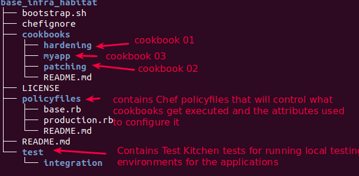
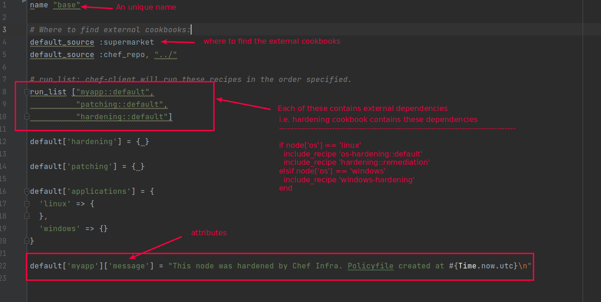
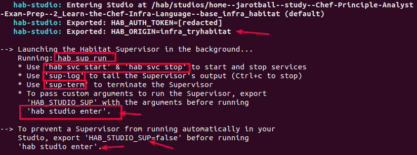
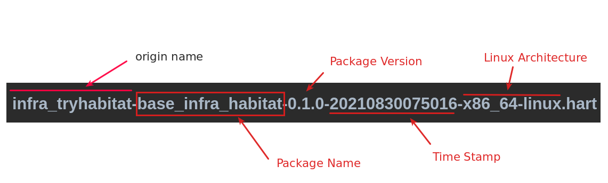

# Lab 06: Using Chef Habitat to build artifacts, load that into a chef infra and Testing the Chef Infra against a Chef Inspec defined
Learning Objective:
- To apply a Chef cookbook to patch and harden a number of compliance related issues on a CentOS node.
- To create a Habitat Package consisting of the chef-client along with the required cookbooks.
- To use Chef Policyfiles to determine the Chef Infra environment and habitat to deploy the Chef Infra Client & cookbooks

### Step 01: Install hab and generate habitat keys
```bash
# 1.1: Check the habitat version
> hab --version           # hab 1.6.351/20210706202052

# 1.2 Habitat requires a origin key
# So, here we will generate a HAB_ORIGIN key

# 1.2.1 Set the HAB_ORIGIN key name to infra_tryhabitat and export it
> export HAB_ORIGIN=infra_tryhabitat
> echo $HAB_ORIGIN

# 1.2.2 Generate the origin key pair (public key + signature) will be generated
# These keys are stored in ~/.hab/cache/keys
> hab origin key generate infra_tryhabitat
---
» Generating origin key for infra_tryhabitat
★ Generated origin key pair infra_tryhabitat-20210830070203.

> ll ~/.hab/cache/keys
```

### Step 02: Clone the existing code repo into ./base_infra_habitat and examine its policyfile::base.rb

```bash
# 2.1 Download the code repo
> git clone git@github.com:learn-chef/lcr-effortless-config-getting-started.git ./base_infra_habitat

# 2.2 Check the repo structure
> tree -L 2 base_infra_habitat
```

```bash
# 2.2 Examine the policyfiles/base.rb
> cd base_infra_habitat
> cat policyfiles/base.rb
```


### Step 03: Initialize a habitat plan, update the plan.sh and set the chef-client parameters in default.toml file
```bash
# 3.1 Initialize a habitat plan
> hab plan init
---
» Constructing a cozy habitat for your app...

Ω Creating file: habitat/plan.sh          #<--- Note
  `plan.sh` is the foundation of your new habitat. It contains metadata, 
  dependencies, and tasks. 

Ω Creating file: habitat/default.toml     #<--- Note
  `default.toml` contains default values for `cfg` prefixed variables. 

Ω Creating file: habitat/README.md
  `README.md` contains a basic README document which you should update. 

Ω Creating directory: habitat/config/     #<--- NOTE
  `/config/` contains configuration files for your app. 

Ω Creating directory: habitat/hooks/      #<--- NOTE
  `/hooks/` contains automation hooks into your habitat. 

# 3.2 Now update the habitat/plan.sh as below
> vim habitat/plan.sh
---
scaffold_policy_name="base"     # this is the name of your Chef Infra policyfile. It maps to base_infra_habitat/policyfiles/base.rb
pkg_name=base_infra_habitat     # Metadata:: Default to the directory name
pkg_origin=infra_tryhabitat     # Metadata      # These Metadata describes the application and is used by the Habitat Build process to create the eventual .HART file.
pkg_version="0.1.0"             # Metadata
pkg_maintainer="The Habitat Maintainers <humans@habitat.sh>"
pkg_description="The Chef $scaffold_policy_name Policy"
pkg_upstream_url="http://chef.io"
pkg_scaffolding="chef/scaffolding-chef-infra" # Defines the required scaffolding containing all of the code necessary to compile your cookbooks and package them up + Application lifecycle hooks to run the Chef Infra Client
pkg_svc_user=("root")           # the user that the chef-client runs under
pkg_exports=(
  [chef_client_ident]="chef_client_ident" # Key:Value pair. This is exposed by chef-client to other applications via the supervisor ring
)

```

> ##### Notes:
> - Here in **habitat/plan.sh** we have used **chef/scaffolding-chef-infra** to pull the required dependencies and build the .HART artifact.
> - **scaffolding** shields us from a lot of the complexities requires in setting up our application.
> - i.e. we require a **run hook** to deploy our application and start **chef-client**:: This run hook is implemented though the scaffolding.

```bash
# 3.3 Chef client requires a number of parameters to be set at runtime.
# Define these parameters in habitat/default.toml
> vim habitat/default.toml
---
interval = 300
splay = 30              # A random number between zero and splay that is added to interval.
                        # Use splay to help balance the load on the Chef Infra Server by ensuring that many Chef Infra Client runs are not occurring at the same interval.
                        # Default value: nil
splay_first_run = 0
run_lock_timeout = 300  # The amount of time (in seconds) to wait for a Chef Infra Client lock file to be deleted.
                        # A Chef Infra Client run will not start when a lock file is present. 
                        # If a lock file is not deleted before this time expires, the pending Chef Infra Client run will exit.
                        # Default value: not set (indefinite). Set to 0 to cause a second Chef Infra Client to exit immediately.
                        
log_level = "warn"
env_path_prefix = "/sbin:/usr/sbin:/usr/local/sbin:/usr/local/bin:/usr/bin:/bin"
ssl_verify_mode = ":verify_none"

[automate]
enable = false
server_url = "https://example.a2server.com"
token = "example_token"

[chef_license]
acceptance = "accept-no-persist"  # Used to accept the Chef license. Can be set to accept or accept-no-persist, 
                                  # which persists the license acceptance to disk.
```

### Step 04: Build the code
```bash
# 4.1 Enter into the hab studio
> hab studio enter
```


```bash
# 4.2 Check the contents into the hab studio and find where the Present Working directory is mount under the hab studio
[1][default:/src:0]# ls
---
LICENSE  README.md  bootstrap.sh  chefignore  cookbooks  habitat  policyfiles  test

[2][default:/src:0]# pwd
---
/src      # <---- Hab studio mount the PWD into its own /src directory

# 4.3 Now build the .HART artifact as defined in habitat/plan.sh and habitat/default.toml
[3][default:/src:0]# build
---
... (skipped)
Building policy base
Expanded run list: recipe[myapp::default], recipe[patching::default], recipe[hardening::default]
Caching Cookbooks...
Installing myapp                   0.1.0
Installing patching                0.1.0
Installing hardening               0.1.0
Installing os-hardening            4.0.0
Installing windows-hardening       0.9.1
Installing windows-security-policy 0.3.9

... (skipped)
base_infra_habitat: Source Path: /src
   base_infra_habitat: Installed Path: /hab/pkgs/infra_tryhabitat/base_infra_habitat/0.1.0/20210830075016
   base_infra_habitat: Artifact: /src/results/infra_tryhabitat-base_infra_habitat-0.1.0-20210830075016-x86_64-linux.hart
   base_infra_habitat: Build Report: /src/results/last_build.env
   base_infra_habitat: SHA256 Checksum: 8cbfd61c194b27b46b14b86a8539bc221f9c96f8badeaddc6f377e4e4ce297aa
   base_infra_habitat: Blake2b Checksum: 28847cfe230a5e179b58725af1e8884d0e008fdacea802bfee933166c831b9bf
   base_infra_habitat: 
   base_infra_habitat: I love it when a plan.sh comes together.   # This means, build is successful

# 4.4 Check whether the .HART artifact is created or not
[4][default:/src:0]# ls results
---
infra_tryhabitat-base_infra_habitat-0.1.0-20210830075016-x86_64-linux.hart      # this is the artifact we just built
last_build.env   # Lets dig into it!!!     

# 4.5 Dig into the results/last_build.env and what it contains
# last_build.env contains the information of pkg_artifact we created latest without even remembering what was built earlier
[5][default:/src:0]# cat results/last_build.env 
----
pkg_origin=infra_tryhabitat     # <-- This originname was defined in habitat/plan.sh
pkg_name=base_infra_habitat     # <-- This name was defined in habitat/plan.sh
pkg_version=0.1.0               # <-- This version was defined in habitat/plan.sh
pkg_release=20210830075016
pkg_target=x86_64-linux
pkg_ident=infra_tryhabitat/base_infra_habitat/0.1.0/20210830075016
pkg_artifact=infra_tryhabitat-base_infra_habitat-0.1.0-20210830075016-x86_64-linux.hart   # <-- NOTE
pkg_sha256sum=8cbfd61c194b27b46b14b86a8539bc221f9c96f8badeaddc6f377e4e4ce297aa
pkg_blake2bsum=28847cfe230a5e179b58725af1e8884d0e008fdacea802bfee933166c831b9bf

```

> ### .HART file skeleton
> 

### Step 05: Test the code
```bash
# 5.1 Have a look at base_infra_habitat/.kitchen.yml
> vim base_infra_habitat/.kitchen.yml
---
driver:
  name: vagrant
  synced_folders:
   - ["./results", "/tmp/results"]  # The test VM mounts the local Habitat results directory to /tmp/results

provisioner:
  name: shell

verifier:
  name: inspec

platforms:
  - name: centos-7.5

suites:             # The policies and code which will be enforces on the test instance(s)
  - name: base      # test/integration/base/patching_test.rb
    provisioner:
      arguments: ["<%= ENV['HAB_ORIGIN'] %>", "base"] # The name of the origin name and the policyfile are passed into the bootstrap.sh script
    verifier:
      inspect_tests:
        test/integration/base

# 5.2 Check the kitchen list
> cd base_infra_habitat
> kitchen list
---
Instance        Driver   Provisioner  Verifier  Transport  Last Action    Last Error
base-centos-75  Vagrant  Shell        Inspec    Ssh        <Not Created>  <None>

# 5.3 Create the VM using kitchen converge command [this section has an error ]
# Error: 
-------------------------ERROR--------------------------------------------------------
☛ Verifying infra_tryhabitat/base_infra_habitat/0.1.0/20210830075016
       ↓ Downloading infra_tryhabitat-20210830070203 public origin key
       ✗✗✗
       ✗✗✗ [404 Not Found]
       ✗✗✗
       Determining pkg_prefix for /tmp/results/infra_tryhabitat-base_infra_habitat-0.1.0-20210830075016-x86_64-linux.hart
       find: '/hab/pkgs/infra_tryhabitat/base': No such file or directory
       Found 
       Running chef for infra_tryhabitat/base
       ✗✗✗
       ✗✗✗ Cannot find a release of package: infra_tryhabitat/base
       ✗✗✗
----------------------------------ERROR-----------------------------------------------
> kitchen converge
---
-----> Starting Test Kitchen (v3.0.0)
-----> Creating <base-centos-80>...
       Bringing machine 'default' up with 'virtualbox' provider...
       ==> default: Importing base box 'bento/centos-8.0'.

> kitchen list

# 5.4 Lets verify the VM against our integration tests defined in test/integration/base/patching_test.rb
# Have a look at whats inside the patching_test.rb
> cat test/integration/base/patching_test.rb
---
# it will look for whether the file chef_patching_sentinel exists or not
describe file('/hab/svc/base/data/cache/cache/chef_patching_sentinel') do
  it { should exist }
end

> kitchen verify # it will run the InSpec code defined in patching_test.rb and look for whether the mentioned file exists of not

```


