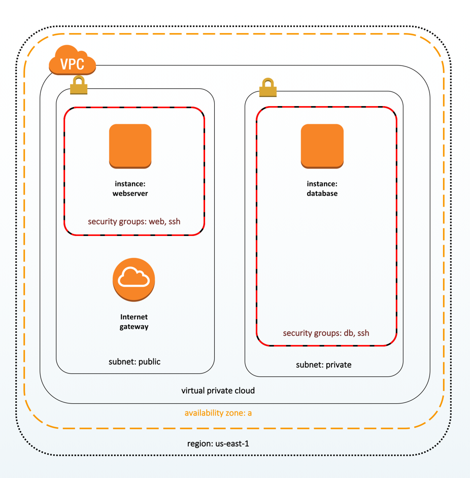

# Lab 11: Build the following deployment architecture in AWS using Terraform


## Details Description 
This topology forms a basic three-tier web server and database deployment. In summary:

- the VPC contains two subnets, one for public (Internet) traffic and one for traffic on the private network only.
- three security groups provide inbound network traffic on ports 22 (SSH), 80 (HTTP), and 3306 (MySQL).
- two EC2 instances (running Ubuntu 16.04) define the web server and database server. 
  - The web server is allocated on the public subnet so that it can receive Internet traffic. It provides inbound network access on ports 22 and 80. 
  - The database server is allocated on the private subnet so that it can receive traffic only from the internal network. It provides inbound network access on ports 22 and 3306.

The EC2 instances do not have any web server or database software installed. They exist to model the roles they would play in a typical three-tier web server and database deployment.

Terraform supports a variety of cloud providers. Each cloud provider is implemented as a plugin.

### Step 01: Store the aws credentials in terraform.tfvars and load these into our main terraform archiotecture at main.tf
```bash
# 1.1 Create a file named terraform.tfvars to store the aws-credentials
> vim learn-inspec/terraform.tfvars
---
  1 aws_access_key = "XXXXXXXXXXXXXXXXXXXXXX"
  2 aws_secret_key = "YYYYYYYYYYYYYYYYYYYYYYYYYYYYYYYYYYYYYY"
  3 aws_region = "us-west-1"
  4 aws_availability_zone = "a"


# 1.2 Define the aws credentials as terraform variables
# AWS Credentials required: (a) aws_access_key (b) aws_secret_key (c) aws_region (d) aws_availability_zone

> vim learn-inspec/main.tf
---
  1 #
  2 # Variables
  3 #
  4 
  5 variable "aws_access_key" {
  6 }
  7 
  8 variable "aws_secret_key" {
  9 }
 10 
 11 variable "aws_region" {
 12   default = "us-west-1"
 13 }
 14 
 15 variable "aws_availability_zone" {
 16   default = "a"
 17 }

# 1.3 Load these aws credentials from the terraform.tfvars to variables defined in main.tf
> vim learn-inspec/main.tf
---
...(skipped)
 19 #
 20 # Provider
 21 #
 22 
 23 provider "aws" {
 24   access_key = var.aws_access_key
 25   secret_key = var.aws_secret_key
 26   region     = var.aws_region
 27 }
```

### Step 02: This terraform architecture will load the EC2 instances using ubuntu 16.04 
- So we need to retrieve the latest AMI ID for Ubuntu 16.04 as available in AWS
- Ubuntu 16.04 AMI is owned by Canonical having owner_id = **099720109477**
- Virtualization used **HVM**

```bash
> vim learn-inspec/main.tf

# 2.1 Retrieve the latest Ubuntu 16.04 AMI ID
 29 #
 30 # Data
 31 #
 32 
 33 # This retrieves the latest AMI ID for Ubuntu 16.04.
 34 
 35 data "aws_ami" "ubuntu" {
 36   most_recent = true
 37   owners      = ["099720109477"] # Canonical
 38 
 39   filter {
 40     name   = "name"
 41     values = ["ubuntu/images/hvm-ssd/ubuntu-xenial-16.04-amd64-server-*"]
 42   }
 43 
 44   filter {
 45     name   = "virtualization-type"
 46     values = ["hvm"]
 47   }
 48 }

```

### Step 03: Creating a new VPC
##### The new VPC will contains the followings
- **vpc name**: default, cidr_block: 10.0.0.0/16, used inspec resource: "aws_vpc"
- **Internet Gateway**::default.
  - inspec resource: aws_internet_gateway
- **Route Tables** and add the internet_gateway associated with 0.0.0.0/0 (as destination) as table entry
  - inspec resource: "aws_route"
  - Route Table Name: "Internet Access"
- **Subnet 1:** Public Subnet for webserver
  - Choose the vpc id
  - subnet IPv4 CIDR Block: 10.0.1.0/24
  - map it public facing
  - availability zone: us-west.1a
- **Subnet 2**: Private Subnet for database server
  - Choose the VPC id
  - subnet I{v4 CIDR Block: 10.0.100.0/24
  - availability zone: us-west.1a

```bash
> vim learn-inspec/main.tf

# 3.1 Create a new vpc named "default" with CIDR block 10.0.0.0/16
 50 #
 51 # Creation
 52 #
 53 
 54 # networking
 55 
 56 resource "aws_vpc" "default" {
 57   cidr_block = "10.0.0.0/16"
 58 }
 
# 3.2 Create a new Internet Gateway named "default" and associate it with the VPC we crated above
 60 resource "aws_internet_gateway" "default" {
 61   vpc_id = aws_vpc.default.id
 62 }

# 3.3 Create a new Route Table named "internet_access" and add the Internet gateway with outgress 0.0.0.0/0
 64 resource "aws_route" "internet_access" {
 65   route_table_id         = aws_vpc.default.main_route_table_id
 66   destination_cidr_block = "0.0.0.0/0"
 67   gateway_id             = aws_internet_gateway.default.id
 68 }
 
# 3.4 Create Subnet-01: Public Subnet with CIDR 10.0.1.0/24 and map this to public facing for Webserver and launch the subnet from us-west.1a
 70 resource "aws_subnet" "public" {
 71   vpc_id                  = aws_vpc.default.id
 72   cidr_block              = "10.0.1.0/24"
 73   map_public_ip_on_launch = true
 74   availability_zone       = "${var.aws_region}${var.aws_availability_zone}"
 75 }
 
 # 3.5 Create Subnet-02: Private for DB Sever with CIDR block: 10.0.100.0/24 in us-west.1b
 77 resource "aws_subnet" "private" {
 78   vpc_id            = aws_vpc.default.id
 79   cidr_block        = "10.0.100.0/24"
 80   availability_zone = "${var.aws_region}${var.aws_availability_zone}"
 81 }
```

### Step 04: Create the Security Groups 
Here, we will create 3x security groups:
- **Security Group 01: SSH**
  - **sg name**: learn_chef_ssh
  - **description**: give its a small description i.e. purpose
  - **vpc**: new vpc we created above
  - Add the **Inbound/ingress** rules
    - **Protocol**: tcp
    - **from_port**: 22
    - **to_port**: 22
    - **cidr_blocks**: 0.0.0.0/0 ; means can ssh to ec2 instance from anywhere
  - Add the **Outbound/egress** rules:: Allow all outbound traffic
    - **Protocol**: -1 (means All)
    - **from_port**: 0
    - **to_port**: 0
    - **cid_blocks**: 0.0.0.0/0

- **Security Group 02: web**
  - **sg name**: learn_chef_web
  - **description**: give its a small description i.e. purpose
  - **vpc**: new vpc we created above
  - Add the **Inbound/ingress** rules
    - **Protocol**: tcp
    - **from_port**: 80
    - **to_port**: 80
    - **cidr_blocks**: 0.0.0.0/0
  - Add the **Outbound/egress** rules:: Allow all outbound traffic
    - **Protocol**: -1 (means All)
    - **from_port**: 0
    - **to_port**: 0
    - **cid_blocks**: 0.0.0.0/0

- **Security Group 03: mysql** ; DB Server at Private Subnet; restricted access only from instances at Subnet 01
  - **sg name**: learn_chef_mysql
  - **description**: give its a small description i.e. purpose
  - **vpc**: new vpc we created above
  - Add the **Inbound/ingress** rules
    - **Protocol**: tcp
    - **from_port**: 3306 ; mysql port
    - **to_port**: 3306
    - **cidr_blocks**: 10.0.1.0/24 ; means only accessible from ec2 instances at subnet 10.0.1.0/24, not from everyone
  - Add the **Outbound/egress** rules:: Allow all outbound traffic
    - **Protocol**: -1 (means All)
    - **from_port**: 0
    - **to_port**: 0
    - **cid_blocks**: 0.0.0.0/0

```bash
> vim learn-inspec/main.tf

# 4.1 Create Security Group 01: SSH
 83 resource "aws_security_group" "ssh" {
 84   name        = "learn_chef_ssh"
 85   description = "Used in a terraform exercise"
 86   vpc_id      = aws_vpc.default.id
 87 
 88   # SSH access from anywhere
 89   ingress {
 90     from_port   = 22
 91     to_port     = 22
 92     protocol    = "tcp"
 93     cidr_blocks = ["0.0.0.0/0"]
 94   }
 95 
 96   # outbound internet access
 97   egress {
 98     from_port   = 0
 99     to_port     = 0
100     protocol    = "-1"
101     cidr_blocks = ["0.0.0.0/0"]
102   }
103 }

# 4.2 Create Security Group 02: web
105 resource "aws_security_group" "web" {
106   name        = "learn_chef_web"
107   description = "Used in a terraform exercise"
108   vpc_id      = aws_vpc.default.id
109 
110   # Allow inbound HTTP connection from all
111   ingress {
112     from_port   = 80
113     to_port     = 80
114     protocol    = "tcp"
115     cidr_blocks = ["0.0.0.0/0"]
116   }
117 
118   # outbound internet access
119   egress {
120     from_port   = 0
121     to_port     = 0
122     protocol    = "-1"
123     cidr_blocks = ["0.0.0.0/0"]
124   }
125 }

# 4.3 Create Security Group 03: mysql
127 resource "aws_security_group" "mysql" {
128   name        = "learn_chef_mysql"
129   description = "Used in a terraform exercise"
130   vpc_id      = aws_vpc.default.id
131 
132   # Allow inbound TCP connection for MySql from instances from the public subnet
133   ingress {
134     from_port   = 3306
135     to_port     = 3306
136     protocol    = "tcp"
137     cidr_blocks = ["10.0.1.0/24"]
138   }
139 
140   # Allow inbound TCP connection for MySql from instances from the private subnet
141   ingress {
142     from_port   = 3306
143     to_port     = 3306
144     protocol    = "tcp"
145     cidr_blocks = ["10.0.100.0/24"]
146   }
147 
148   # outbound internet access
149   egress {
150     from_port   = 0
151     to_port     = 0
152     protocol    = "-1"
153     cidr_blocks = ["0.0.0.0/0"]
154   }
155 }
```

### Step 05: Create 2x EC2 instances

| EC2 Instance | AMI | Instance Type | Availability Zone | Security Groups | Subnet (from where to launch) | Tags (Name) |
| :--- | :---: | :---: | :---: | :---: | :---: | :---: | 
| webserver | Ubuntu 16.04 | t2.micro | us-west-1a | ssh, web | Public Subnet (10.0.1.0/24) | webserver |
| dbserver | Ubuntu 16.04 | t2.micro | us-west-1a | ssh, mysql | Private Subnet (10.0.100.0/24) | database |

```bash
> vim learn-inspec/main.tf

# 5.1 Create EC2 instance for webserver
157 # instances
158 
159 resource "aws_instance" "webserver" {
160   ami                    = data.aws_ami.ubuntu.id
161   instance_type          = "t2.micro"
162   availability_zone      = "${var.aws_region}${var.aws_availability_zone}"
163   vpc_security_group_ids = [aws_security_group.ssh.id, aws_security_group.web.id]
164   subnet_id              = aws_subnet.public.id
165 
166   tags = {
167     Name = "webserver"
168   }
169 }

# 5.2 Create EC2 instance for database server
171 resource "aws_instance" "database" {
172   ami                    = data.aws_ami.ubuntu.id
173   instance_type          = "t2.micro"
174   availability_zone      = "${var.aws_region}${var.aws_availability_zone}"
175   vpc_security_group_ids = [aws_security_group.ssh.id, aws_security_group.mysql.id]
176   subnet_id              = aws_subnet.private.id
177 
178   tags = {
179     Name = "database"
180   }
181 }
```

### Step 6: The Final Step: Generate the terraform output in the following format
```text
ec2_instance_database = "i-0094c461f36b1461f"
ec2_instance_database_ami = "ami-0fdf8b5989f22a4e0"
ec2_instance_database_instance_type = "t2.micro"
ec2_instance_database_name = "database"
ec2_instance_database_private_ip = "10.0.100.111"

ec2_instance_webserver = "i-04baad45cf2c905f4"
ec2_instance_webserver_ami = "ami-0fdf8b5989f22a4e0"
ec2_instance_webserver_instance_type = "t2.micro"
ec2_instance_webserver_name = "webserver"
ec2_instance_webserver_public_ip = "54.219.71.73"
image_id = "ami-0fdf8b5989f22a4e0"

route_internet_access_id = "rtb-09883b4f2945b8150"
security_group_mysql_id = "sg-066af82a50803e651"
security_group_ssh_id = "sg-0eb9a53fcca10d27d"
security_group_web_id = "sg-0b6a930b9433c7462"

subnet_private_id = "subnet-015bb5cb61be74b4b"
subnet_public_id = "subnet-01dc3d968389fd40e"

vpc_id = "vpc-076ac46a147873e39"
```

```bash
> vim learn-inspec/main.tf

# 6.1 Output the AMI ID
183 #
184 # Output
185 #
186 
187 # AMI ID
188 
189 output "image_id" {
190   value = data.aws_ami.ubuntu.id
191 }

# 6.2 Output the webserver details {name, id, ami, instance_type, public_ip}
193 # webserver details
194 
195 output "ec2_instance_webserver_name" {
196   value = aws_instance.webserver.tags.Name
197 }
198 
199 output "ec2_instance_webserver" {
200   value = aws_instance.webserver.id
201 }
202 
203 output "ec2_instance_webserver_ami" {
204   value = aws_instance.webserver.ami
205 }
206 
207 output "ec2_instance_webserver_instance_type" {
208   value = aws_instance.webserver.instance_type
209 }
210 
211 output "ec2_instance_webserver_public_ip" {
212   value = aws_instance.webserver.public_ip
213 }


# 6.3 Output the Database Server details {name, id, ami, instance_type, private_ip}
215 # database details
216 
217 output "ec2_instance_database_name" {
218   value = aws_instance.database.tags.Name
219 }
220 
221 output "ec2_instance_database" {
222   value = aws_instance.database.id
223 }
224 
225 output "ec2_instance_database_ami" {
226   value = aws_instance.database.ami
227 }
228 
229 output "ec2_instance_database_instance_type" {
230   value = aws_instance.database.instance_type
231 }
232 
233 output "ec2_instance_database_private_ip" {
234   value = aws_instance.database.private_ip
235 }

# 6.4 Output the Network details {vpc_id, subnet_public_id, subnet_private_id, 
# security_group_web_id, security_group_mysql_id, security_group_ssh_id, route_internet_access_id:: route table}
237 # networking details
238 
239 output "vpc_id" {
240   value = aws_vpc.default.id
241 }
242 
243 output "subnet_public_id" {
244   value = aws_subnet.public.id
245 }
246 
247 output "subnet_private_id" {
248   value = aws_subnet.private.id
249 }
250 
251 output "security_group_web_id" {
252   value = aws_security_group.web.id
253 }
254 
255 output "security_group_mysql_id" {
256   value = aws_security_group.mysql.id
257 }
258 
259 output "security_group_ssh_id" {
260   value = aws_security_group.ssh.id
261 }
262 
263 output "route_internet_access_id" {
264   value = aws_route.internet_access.route_table_id
265 }
```