# Lab 12: Scan the Cloud Infrastructure to validate that configuration and installed software meet your complianceand security requirements.
- InSpec can also test specific cloud provider assets i.e. AWS IAM roles, security groups and other AWS resources.

Objective:
- Use InSpec to verify the state of your AWS Cloud Infrastructure
- Use HasiCorp's Terraform to create infratructure and then use InSpec to verify that infrastructure.

#### Note: This experiment is not done from the Host Machine. Rather the Chef Infra at Docker Workstation is used.
### Step 01: Environment Setup 
```bash
# 1.1 Download the docker-compose file which includes 1x workstation and 1x target machine
> wget https://raw.githubusercontent.com/learn-chef/inspec/master/docker-compose.yml
> cat docker-compose.yml
---
version: '3'
services:
  workstation:
    container_name: workstation             #(default user: root, password: password, hostname: workstation)
    image: learnchef/inspec_workstation     # Image 01: docker will pull it 
    stdin_open: true
    tty: true
    links:
      - target
    volumes:
      - .:/root
  target:                                   #(default user: root, password: password, hostname: target)
    image: learnchef/inspec_target          # Image 02: dokcer will pull it      
    stdin_open: true
    tty: true

# 1.2 pull the docker images and up the docker containers in detached mode (-d)
> docker-compose pull
> docker-compse up -d 
---
Creating learn-inspec_target_1 ... done
Creating workstation           ... done

```

### Step 02: Environment Setup at Docker::Workstation

```bash
# 2.1 login to the workstation
> docker exec -it workstation bash

@workstation
root@61ccb62cf224:  # Docker Workstation
# 2.2 Check for the aws related inspec resources 
# The aws resources must be available in inspec, else this experiment cant be done
# for this experiment we need the following inspec aws resources: {aws_ec2_instance, aws_security_group
# aws_security_groups, aws_subnet, aws_subnets, aws_vpc, aws_vpcs }

> inspec shell
inspec> help resources
```
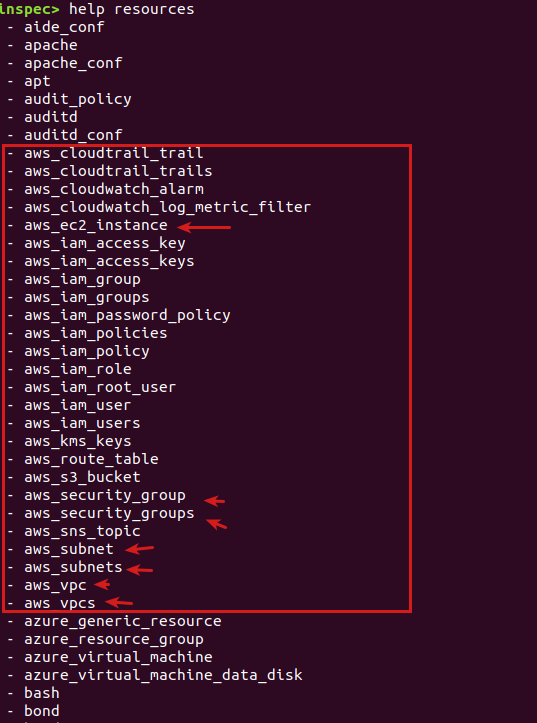

```bash
# 2.3 Install awscli @workstation and configure aws
> apt-get update && apt-get install awscli
> aws --version           # aws-cli/1.18.69 Python/3.5.2 Linux/5.4.0-81-generic botocore/1.16.19
> aws configure

> cat ~/.aws/config 
---
[default]
output = json
region = us-west-1

> cat ~/.aws/credentials
---
[default]
aws_access_key_id = XXXXXXXXXXXXX
aws_secret_access_key = YYYYYYYYYYYYYYYYYYY/YYYY/YYYYYYYYY

# 2.4 Install terraform @workstation
> cd ~
> wget https://releases.hashicorp.com/terraform/1.0.5/terraform_1.0.5_linux_amd64.zip
> unzip terraform_1.0.5_linux_amd64.zip 
> mv terraform /usr/local/bin/
> terraform --version
---
Terraform v1.0.5
on linux_amd64
+ provider registry.terraform.io/hashicorp/aws v3.56.0

```

### Step 03: Build the terraform architecture into AWS
```bash
@workstation
# 3.1 Run terraform init to ensure the plugins you need are installed.
# Terraform installs the AWS provider driver based on the Terraform template that it found in the current directory.
> terraform init 
```
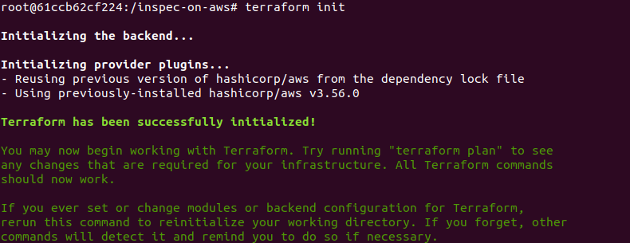

```bash
# 3.2 Lets see what resources it would create before you run Terraform to create your infrastructure
> terraform plan
```
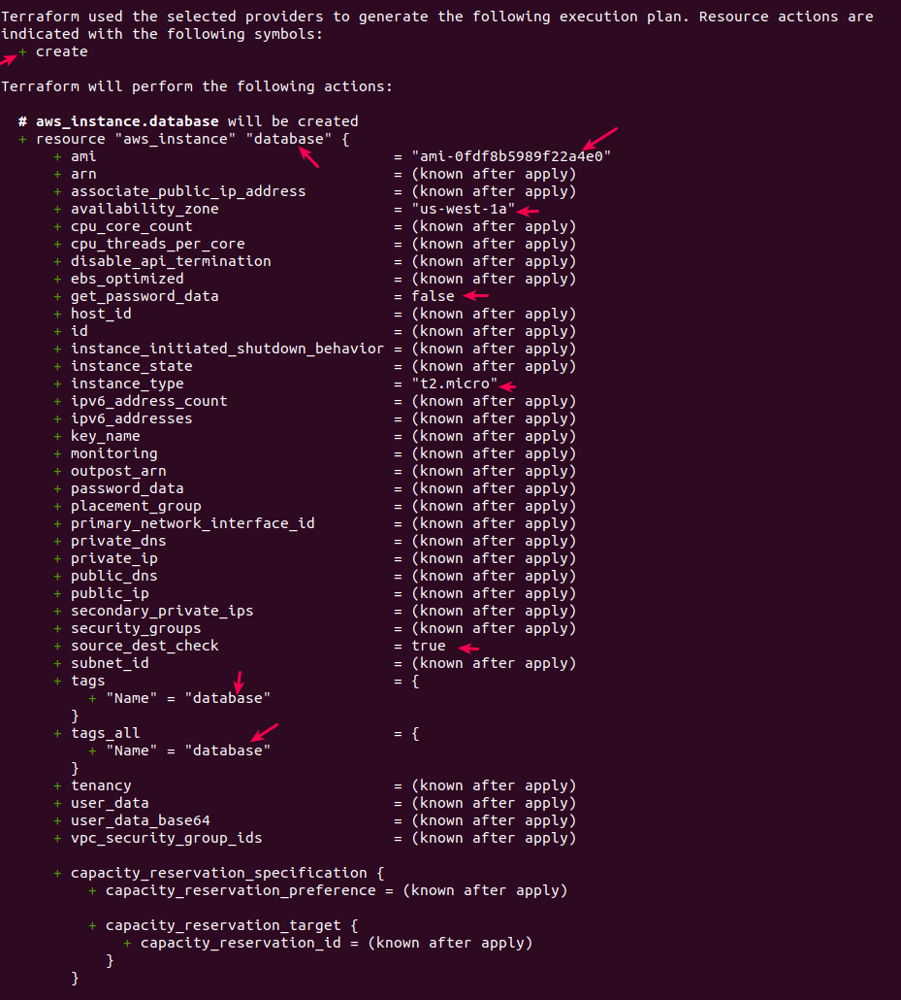
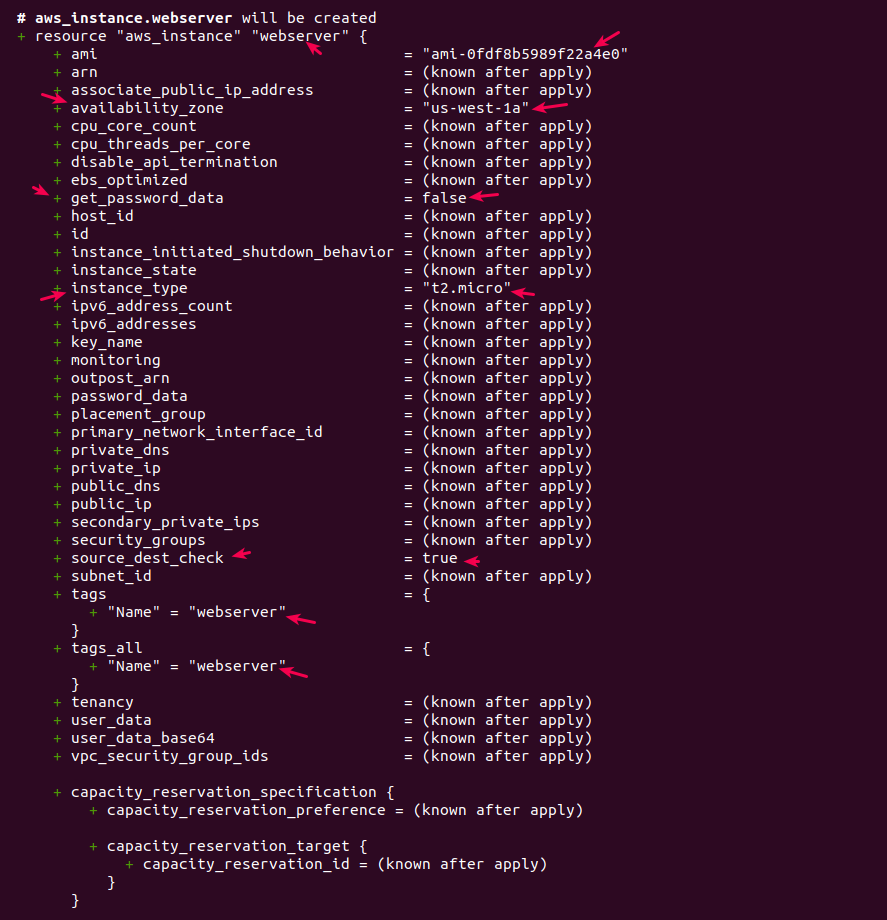
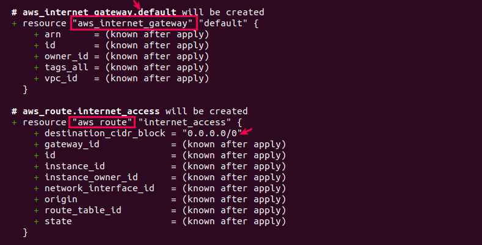
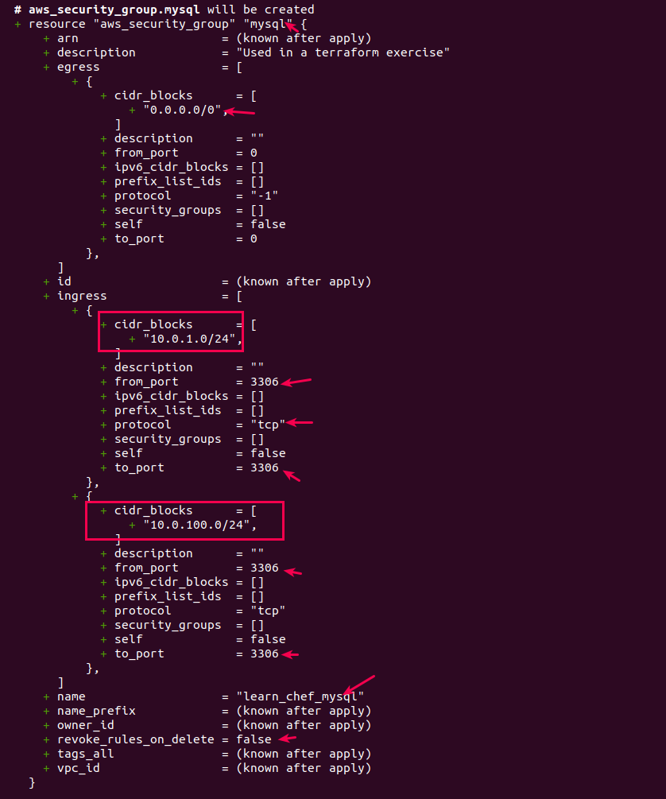
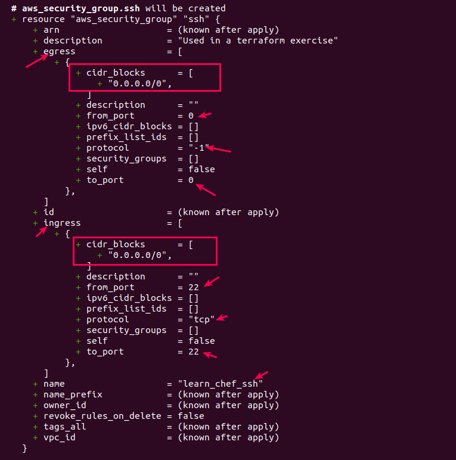
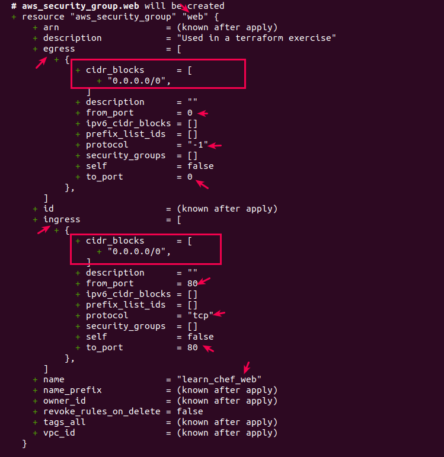
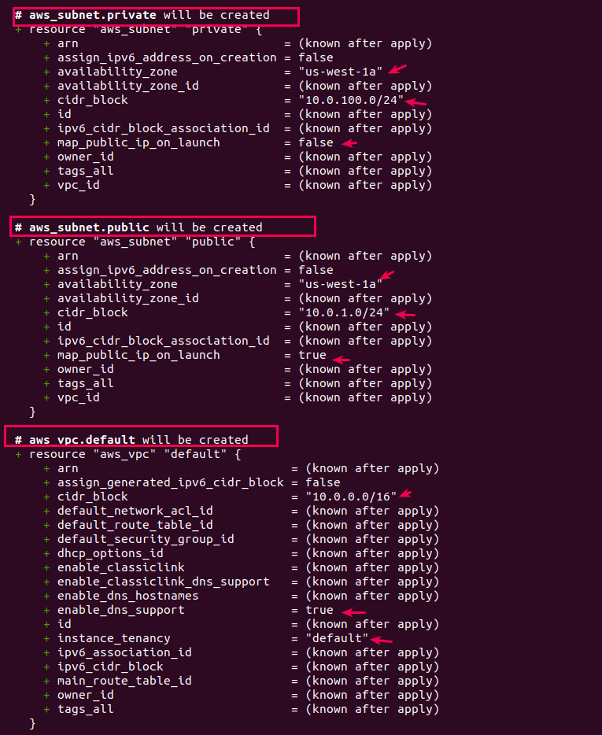
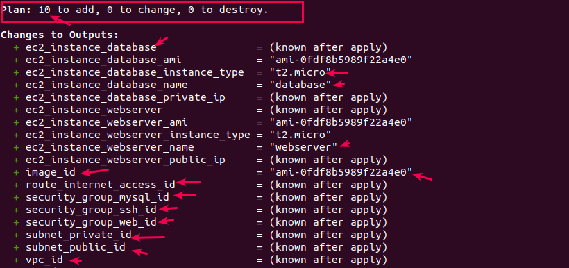

```bash
# 3.3 Create the terraform architecture into AWS
> terraform apply -auto-approve  # -auto-approve flag can be omitted, but then terraform will ask for permission all the time

# 3.4 Verify that the resoruces are present through the AWS management console or the AWS CLI
```
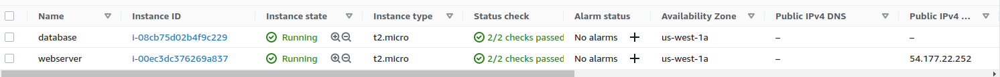

```bash
# 3.5 Run the terraform output to view the information about the deployment
@workstation
> terraform output
ec2_instance_database = "i-08cb75d02b4f9c229"
ec2_instance_database_ami = "ami-0fdf8b5989f22a4e0"
ec2_instance_database_instance_type = "t2.micro"
ec2_instance_database_name = "database"
ec2_instance_database_private_ip = "10.0.100.240"
ec2_instance_webserver = "i-00ec3dc376269a837"
ec2_instance_webserver_ami = "ami-0fdf8b5989f22a4e0"
ec2_instance_webserver_instance_type = "t2.micro"
ec2_instance_webserver_name = "webserver"
ec2_instance_webserver_public_ip = "`54.177.22.252`"
image_id = "ami-0fdf8b5989f22a4e0"
route_internet_access_id = "rtb-0c11715f2f5c8b18d"
security_group_mysql_id = "sg-0dfe24f8d6f5ec970"
security_group_ssh_id = "sg-09a271b08c2587055"
security_group_web_id = "sg-0dd46f0b0444f6760"
subnet_private_id = "subnet-0b047e62da882a939"
subnet_public_id = "subnet-0b5a2d782776a7df8"
vpc_id = "vpc-07fb934f7ee378703"
```

### Step 04: Create the InSpec profile
```bash
# 4.1 Create the inspec profile named "aws-security" and remove the default controls/example.rb 
# create a new control file named controls/instances.rb
@workstation
> cd inspec-on-aws
> inspec init profile -p aws aws-security

# 4.2 Check the directory structure after creation
> tree
.
|-- README.md
|-- aws-security
|   |-- README.md
|   |-- controls
|   |   `-- instances.rb   # << New control file 
|   |-- inspec.lock
|   |-- inspec.yml
|   `-- libraries
|-- main.tf
|-- terraform.tfstate
|-- terraform.tfstate.backup
`-- terraform.tfvars

# 4.3 Using inSpec, verify that the ec2 instances are running
> vim aws-security/controls/instances.rb
---
# webserver
describe aws_ec2_instance(name: 'webserver') do
  it { should be_running }
end

# database server
describe aws_ec2_instance('i-08cb75d02b4f9c229') do
  it { should be_running }
end

> inspec exec aws-security -t aws://us-west-1
---
Profile: InSpec Profile (aws-security)
Version: 0.1.0
Target:  aws://us-west-1

  EC2 Instance webserver
     ✔  should be running             # Webserver is running
  EC2 Instance i-08cb75d02b4f9c229
     ✔  should be running             # Database server is running

Test Summary: 2 successful, 0 failures, 0 skipped


# 4.4 Update your control to include the tests that verify each instance's AMI ID, instance size and IP address
> vim aws-security/controls/instances.rb
---
# webserver
describe aws_ec2_instance(name: 'webserver') do
  it { should be_running }
  its('image_id') { should eq 'ami-0fdf8b5989f22a4e0'}          # << N
  its('instance_type') { should eq 't2.micro' }                 # << N
  its('public_ip_address') { should eq '54.177.22.252'}         # << N, webserver::public IP

end

# database server
describe aws_ec2_instance('i-08cb75d02b4f9c229') do
  it { should be_running }
  its('image_id') { should eq 'ami-0fdf8b5989f22a4e0'}          # << N
  its('instance_type') { should eq 't2.micro' }                 # << N
  its('public_ip_address') { should_not be}                     # << N, dbserver:: has no public IP

end

> inspec exec aws-security -t aws://us-west-1

Profile: InSpec Profile (aws-security)
Version: 0.1.0
Target:  aws://us-west-1

  EC2 Instance webserver
     ✔  should be running
     ✔  image_id should eq "ami-0fdf8b5989f22a4e0"
     ✔  instance_type should eq "t2.micro"
     ✔  public_ip_address should eq "54.177.22.252"
  EC2 Instance i-08cb75d02b4f9c229
     ✔  should be running
     ✔  image_id should eq "ami-0fdf8b5989f22a4e0"
     ✔  instance_type should eq "t2.micro"
     ✔  public_ip_address should not be

Test Summary: 8 successful, 0 failures, 0 skipped

# 4.5 Modify your control to check your VPC settings
> vim aws-security/controls/instances.rb
```
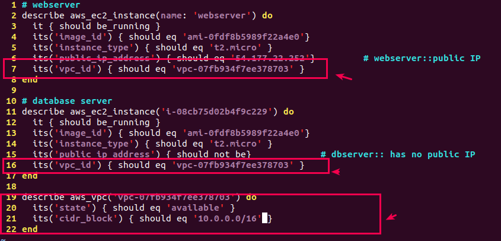
```bash
> inspec exec aws-security -t aws://us-west-1
```
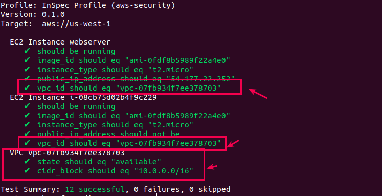

```bash
# 4.6 Modify your control to verify the subnet
> vim aws-security/controls/instances.rb
```
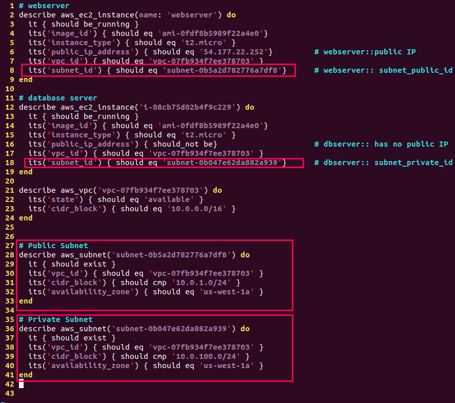
```bash
> inspec exec aws-security -t aws://us-west-1
```
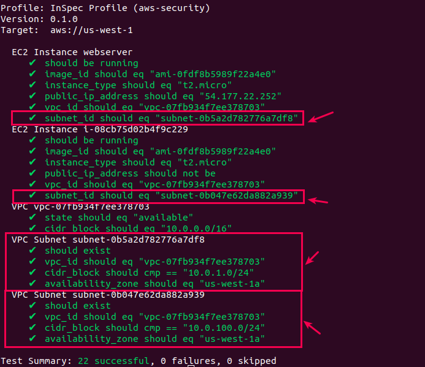

```bash
# 4.7 Modify your control to verify whether each instance specifies the required security groups
> vim aws-security/controls/instances.rb
```
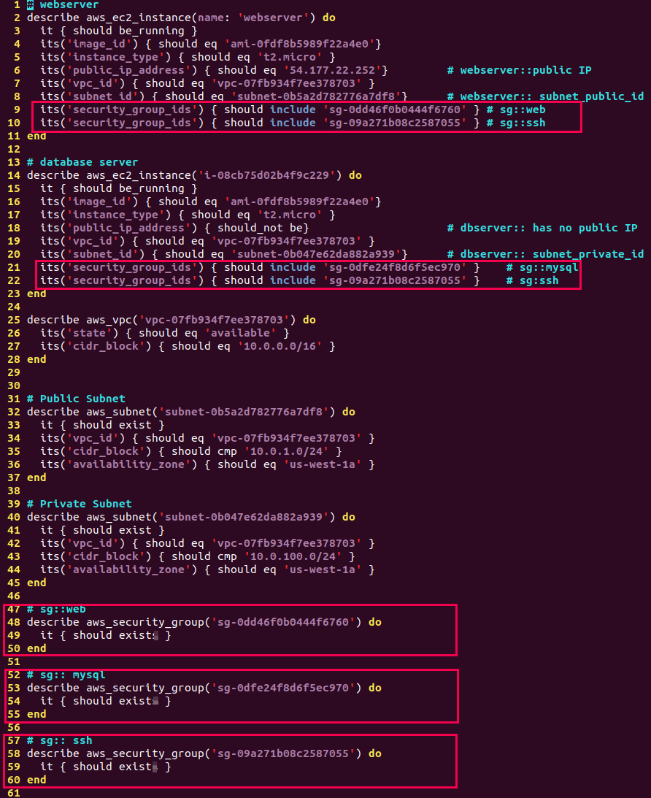
```bash
> inspec exec aws-security -t aws://us-west-1
```
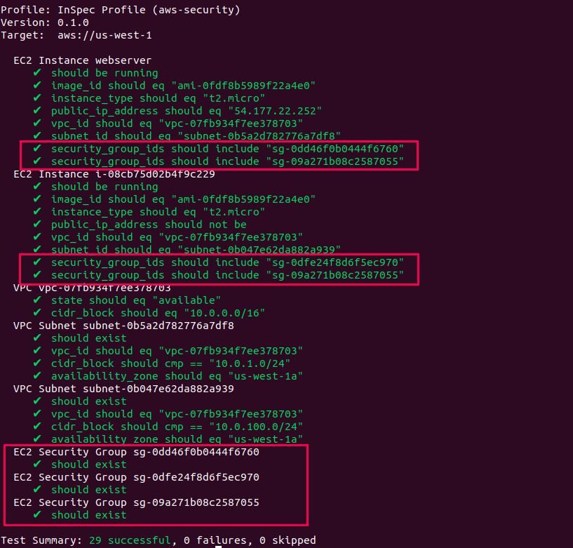