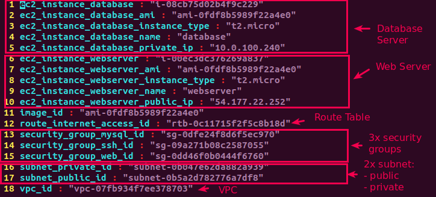
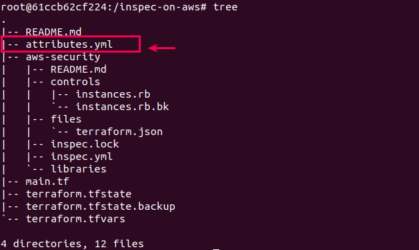
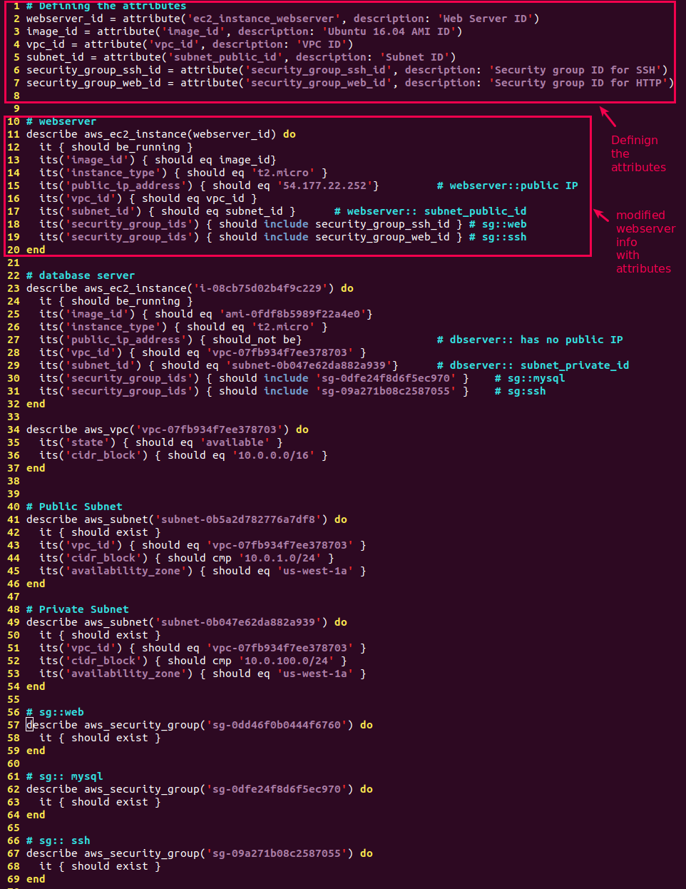
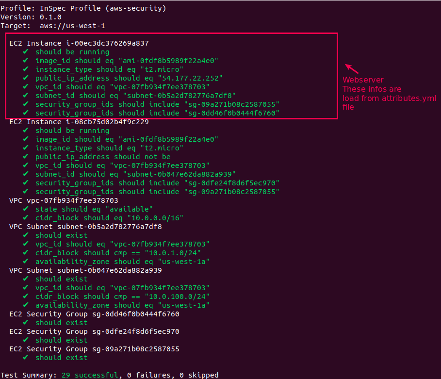

# Lab 13: Refactoring the InSpec Profile with attributes (Alternative 01)
### Pre-requisite: Lab 12
#### Pre-requisite Information: (a) Existing tree structure
```bash
.
|-- README.md
|-- aws-security
|   |-- README.md
|   |-- controls
|   |   |-- instances.rb
|   |-- inspec.lock
|   |-- inspec.yml
|   `-- libraries
|-- main.tf
|-- terraform.tfstate
|-- terraform.tfstate.backup
`-- terraform.tfvars

4 directories, 12 files

```

#### Pre-requisite Information: (b) controls/instances.rb file which we ned to refactor
```ruby
 1 # webserver
  2 describe aws_ec2_instance(name: 'webserver') do
  3   it { should be_running }
  4   its('image_id') { should eq 'ami-0fdf8b5989f22a4e0'}
  5   its('instance_type') { should eq 't2.micro' }
  6   its('public_ip_address') { should eq '54.177.22.252'}         # webserver::public IP
  7   its('vpc_id') { should eq 'vpc-07fb934f7ee378703' }
  8   its('subnet_id') { should eq 'subnet-0b5a2d782776a7df8'}      # webserver:: subnet_public_id
  9   its('security_group_ids') { should include 'sg-0dd46f0b0444f6760' } # sg::web
 10   its('security_group_ids') { should include 'sg-09a271b08c2587055' } # sg::ssh
 11 end
 12 
 13 # database server
 14 describe aws_ec2_instance('i-08cb75d02b4f9c229') do
 15   it { should be_running }
 16   its('image_id') { should eq 'ami-0fdf8b5989f22a4e0'}
 17   its('instance_type') { should eq 't2.micro' }
 18   its('public_ip_address') { should_not be}                     # dbserver:: has no public IP
 19   its('vpc_id') { should eq 'vpc-07fb934f7ee378703' }
 20   its('subnet_id') { should eq 'subnet-0b047e62da882a939'}      # dbserver:: subnet_private_id
 21   its('security_group_ids') { should include 'sg-0dfe24f8d6f5ec970' }    # sg::mysql 
 22   its('security_group_ids') { should include 'sg-09a271b08c2587055' }    # sg:ssh
 23 end
 24 
 25 describe aws_vpc('vpc-07fb934f7ee378703') do
 26   its('state') { should eq 'available' }
 27   its('cidr_block') { should eq '10.0.0.0/16' }
 28 end
 29 
 30 
 31 # Public Subnet
 32 describe aws_subnet('subnet-0b5a2d782776a7df8') do
 33   it { should exist }
 34   its('vpc_id') { should eq 'vpc-07fb934f7ee378703' }
 35   its('cidr_block') { should cmp '10.0.1.0/24' }
 36   its('availability_zone') { should eq 'us-west-1a' }
 37 end
 38 
 39 # Private Subnet
 40 describe aws_subnet('subnet-0b047e62da882a939') do
 41   it { should exist }
 42   its('vpc_id') { should eq 'vpc-07fb934f7ee378703' }
 43   its('cidr_block') { should cmp '10.0.100.0/24' }
 44   its('availability_zone') { should eq 'us-west-1a' }
 45 end
 46 
 47 # sg::web
 48 describe aws_security_group('sg-0dd46f0b0444f6760') do
 49   it { should exist }
 50 end
 51 
 52 # sg:: mysql
 53 describe aws_security_group('sg-0dfe24f8d6f5ec970') do
 54   it { should exist }
 55 end
 56 
 57 # sg:: ssh
 58 describe aws_security_group('sg-09a271b08c2587055') do
 59   it { should exist }
 60 end
```

### Step 01: Refactoring the control file
```ruby
# 1.1 (YML Formatting) Run terraform output with '=' replaces with ':' and save the results in attributes.yml file 
> terraform output | sed s/=/:/g > attributes.yml
> cat attributes.yml
```

```bash
# 1.2 Check the tree structure now
```

```bash
# 1.3 Replaces the hard-code values with attributes
# 1.3.1 At the top of aws-security/controls/instances.rb, define these attributes
> vim aws-security/controls/instances.rb
---
  1 # Defining the attributes
  2 webserver_id = attribute('ec2_instance_webserver', description: 'Web Server ID')
  3 image_id = attribute('image_id', description: 'Ubuntu 16.04 AMI ID')
  4 vpc_id = attribute('vpc_id', description: 'VPC ID')
  5 subnet_id = attribute('subnet_public_id', description: 'Subnet ID')
  6 security_group_ssh_id = attribute('security_group_ssh_id', description: 'Security group ID for     SSH')
  7 security_group_web_id = attribute('security_group_web_id', description: 'Security group ID for     HTTP')
  8 

# 1.3.2 Next, in the same file, replace the first aws_ec2_instance resource (for the web server instance) with this.
> vim aws-security/controls/instances.rb
---
 10 # webserver
 11 describe aws_ec2_instance(webserver_id) do
 12   it { should be_running }
 13   its('image_id') { should eq image_id}
 14   its('instance_type') { should eq 't2.micro' }
 15   its('public_ip_address') { should eq '54.177.22.252'}         # webserver::public IP
 16   its('vpc_id') { should eq vpc_id }
 17   its('subnet_id') { should eq subnet_id }      # webserver:: subnet_public_id
 18   its('security_group_ids') { should include security_group_ssh_id } # sg::web
 19   its('security_group_ids') { should include security_group_web_id } # sg::ssh
 20 end

# 1.4 Now the control file looks like below
```



### Step 02: Run the profile to verify the settings with 'attrs' flag
```bash
# 1.4 Run the profile as you did earlier. This time, specify the --attrs flag like this.
> inspec exec aws-security -t aws://us-west-1 --attrs attributes.yml
```



