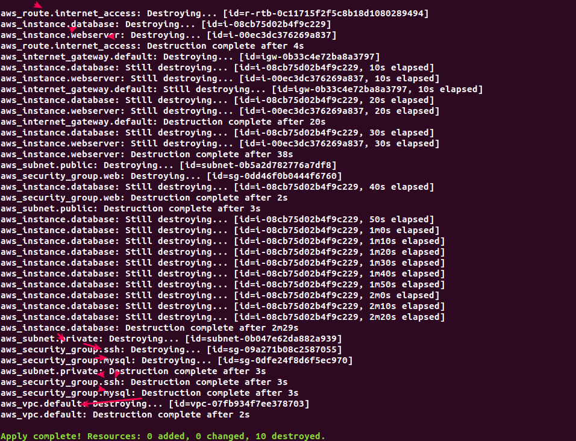

# Lab 14: Refactoring the InSpec Profile with Profile file (Alternative 02)
*** A **Profile file** is stored in the files directory within your project. A profile file can be in any format you choose, not just YAML.

### Pre-requisite: Lab 12
#### Pre-requisite Information: (a) Existing tree structure
```bash
.
|-- README.md
|-- aws-security
|   |-- README.md
|   |-- controls
|   |   |-- instances.rb
|   |-- inspec.lock
|   |-- inspec.yml
|   `-- libraries
|-- main.tf
|-- terraform.tfstate
|-- terraform.tfstate.backup
`-- terraform.tfvars

4 directories, 12 files

```

#### Pre-requisite Information: (b) controls/instances.rb file which we ned to refactor
```ruby
 1 # webserver
  2 describe aws_ec2_instance(name: 'webserver') do
  3   it { should be_running }
  4   its('image_id') { should eq 'ami-0fdf8b5989f22a4e0'}
  5   its('instance_type') { should eq 't2.micro' }
  6   its('public_ip_address') { should eq '54.177.22.252'}         # webserver::public IP
  7   its('vpc_id') { should eq 'vpc-07fb934f7ee378703' }
  8   its('subnet_id') { should eq 'subnet-0b5a2d782776a7df8'}      # webserver:: subnet_public_id
  9   its('security_group_ids') { should include 'sg-0dd46f0b0444f6760' } # sg::web
 10   its('security_group_ids') { should include 'sg-09a271b08c2587055' } # sg::ssh
 11 end
 12 
 13 # database server
 14 describe aws_ec2_instance('i-08cb75d02b4f9c229') do
 15   it { should be_running }
 16   its('image_id') { should eq 'ami-0fdf8b5989f22a4e0'}
 17   its('instance_type') { should eq 't2.micro' }
 18   its('public_ip_address') { should_not be}                     # dbserver:: has no public IP
 19   its('vpc_id') { should eq 'vpc-07fb934f7ee378703' }
 20   its('subnet_id') { should eq 'subnet-0b047e62da882a939'}      # dbserver:: subnet_private_id
 21   its('security_group_ids') { should include 'sg-0dfe24f8d6f5ec970' }    # sg::mysql 
 22   its('security_group_ids') { should include 'sg-09a271b08c2587055' }    # sg:ssh
 23 end
 24 
 25 describe aws_vpc('vpc-07fb934f7ee378703') do
 26   its('state') { should eq 'available' }
 27   its('cidr_block') { should eq '10.0.0.0/16' }
 28 end
 29 
 30 
 31 # Public Subnet
 32 describe aws_subnet('subnet-0b5a2d782776a7df8') do
 33   it { should exist }
 34   its('vpc_id') { should eq 'vpc-07fb934f7ee378703' }
 35   its('cidr_block') { should cmp '10.0.1.0/24' }
 36   its('availability_zone') { should eq 'us-west-1a' }
 37 end
 38 
 39 # Private Subnet
 40 describe aws_subnet('subnet-0b047e62da882a939') do
 41   it { should exist }
 42   its('vpc_id') { should eq 'vpc-07fb934f7ee378703' }
 43   its('cidr_block') { should cmp '10.0.100.0/24' }
 44   its('availability_zone') { should eq 'us-west-1a' }
 45 end
 46 
 47 # sg::web
 48 describe aws_security_group('sg-0dd46f0b0444f6760') do
 49   it { should exist }
 50 end
 51 
 52 # sg:: mysql
 53 describe aws_security_group('sg-0dfe24f8d6f5ec970') do
 54   it { should exist }
 55 end
 56 
 57 # sg:: ssh
 58 describe aws_security_group('sg-09a271b08c2587055') do
 59   it { should exist }
 60 end
```

### Step 01: Refactoring the control with Profile files
```bash
@workstation
# 1.1 Create a new directory called 'files':: where we will write our profile files
> mkdir ~/learn-inspec/inspec-on-aws/aws-security/files

# 1.2 Export the terraform outputs as json and store it in Profile file as terraform.json
> terraform output --json > aws-security/files/terraform.json
> cat aws-security/files/terraform.json
---
{
  "ec2_instance_database": {
    "sensitive": false,
    "type": "string",
    "value": "i-08cb75d02b4f9c229"
  },
  "ec2_instance_database_ami": {
    "sensitive": false,
    "type": "string",
    "value": "ami-0fdf8b5989f22a4e0"
  },
  "ec2_instance_database_instance_type": {
    "sensitive": false,
    "type": "string",
    "value": "t2.micro"
  },
  "ec2_instance_database_name": {
    "sensitive": false,
    "type": "string",
    "value": "database"
  },
  "ec2_instance_database_private_ip": {
    "sensitive": false,
    "type": "string",
    "value": "10.0.100.240"
  },
  "ec2_instance_webserver": {
    "sensitive": false,
    "type": "string",
    "value": "i-00ec3dc376269a837"
  },
  "ec2_instance_webserver_ami": {
    "sensitive": false,
    "type": "string",
    "value": "ami-0fdf8b5989f22a4e0"
  },
  "ec2_instance_webserver_instance_type": {
    "sensitive": false,
    "type": "string",
    "value": "t2.micro"
  },
  "ec2_instance_webserver_name": {
    "sensitive": false,
    "type": "string",
    "value": "webserver"
  },
  "ec2_instance_webserver_public_ip": {
    "sensitive": false,
    "type": "string",
    "value": "54.177.22.252"
  },
  "image_id": {
    "sensitive": false,
    "type": "string",
    "value": "ami-0fdf8b5989f22a4e0"
  },
  "route_internet_access_id": {
    "sensitive": false,
    "type": "string",
    "value": "rtb-0c11715f2f5c8b18d"
  },
  "security_group_mysql_id": {
    "sensitive": false,
    "type": "string",
    "value": "sg-0dfe24f8d6f5ec970"
  },
  "security_group_ssh_id": {
    "sensitive": false,
    "type": "string",
    "value": "sg-09a271b08c2587055"
  },
  "security_group_web_id": {
    "sensitive": false,
    "type": "string",
    "value": "sg-0dd46f0b0444f6760"
  },
  "subnet_private_id": {
    "sensitive": false,
    "type": "string",
    "value": "subnet-0b047e62da882a939"
  },
  "subnet_public_id": {
    "sensitive": false,
    "type": "string",
    "value": "subnet-0b5a2d782776a7df8"
  },
  "vpc_id": {
    "sensitive": false,
    "type": "string",
    "value": "vpc-07fb934f7ee378703"
  }
}

# 1.3 Modify the control file to load the contents of Profile file.
# The content is loaded through the inspec.profile.file method.
>
---
  1 # Importing the profile file and parsing the contents into JSON
  2 content = inspec.profile.file("terraform.json")
  3 params = JSON.parse(content)
  4 
  5 # Defining the attributes - from Profile File
  6 webserver_id = params['ec2_instance_webserver']['value']
  7 dbserver_id = params['ec2_instance_database']['value']
  
  8 image_id = params['image_id']['value']
  
  9 vpc_id = params['vpc_id']['value']
 10 subnet_id_public = params['subnet_public_id']['value']
 11 subnet_id_private = params['subnet_private_id']['value']
 
 12 security_group_ssh_id = params['security_group_ssh_id']['value']
 13 security_group_web_id = params['security_group_web_id']['value']
 14 security_group_mysql_id = params['security_group_mysql_id']['value']
 15 
 16 # Webserver -- Public Subnet
 17 describe aws_ec2_instance(webserver_id) do
 18   it { should be_running }
 19   its('image_id') { should eq image_id }
 20   its('instance_type') { should eq 't2.micro' }
 21   its('vpc_id') { should eq vpc_id }
 22   its('subnet_id') { should eq subnet_id_public }
 23   its('security_group_ids') { should include security_group_ssh_id }
 24   its('security_group_ids') { should include security_group_web_id }
 25 end
 26 
 27 # Database Server -- Private Subnet
 28 describe aws_ec2_instance(dbserver_id) do
 29   it { should be_running }
 30   its('image_id') { should eq image_id }
 31   its('instance_type'){ should eq 't2.micro' }
 32   its('public_ip_address') { should_not be }                    # @Private Subnet, no Public IP Address
 33   its('vpc_id') { should eq vpc_id }
 34   its('subnet_id') { should eq subnet_id_private }     # db server
 35   its('security_group_ids') { should include security_group_ssh_id }   # sg-ssh
 36   its('security_group_ids') { should include security_group_mysql_id }   # sg-mysql
 37 end
 38 
 39 describe aws_vpc(vpc_id) do
 40   its('state') { should eq 'available' }
 41   its('cidr_block') {should eq '10.0.0.0/16'}
 42 end
 43 
 44 # Webserver -- Public Subnet:: 10.0.1.0/24 @us-west-1a
 45 describe aws_subnet(subnet_id_public) do
 46   it { should exist }
 47   its('vpc_id') { should eq vpc_id }
 48   its('cidr_block') { should cmp '10.0.1.0/24'}
 49   its('availability_zone') { should eq 'us-west-1a' }
 50 end
 51 
 52 # Database Server -- Private Subnet:: 10.0.100.0/24 @us-west-1a
 53 describe aws_subnet(subnet_id_private) do
 54   it { should exist }
 55   its('vpc_id') { should eq vpc_id }
 56   its('cidr_block') { should cmp '10.0.100.0/24'}
 57   its('availability_zone') { should eq 'us-west-1a' }
 58 end
 59 
 60 # SG-SSH
 61 describe aws_security_group(security_group_ssh_id) do
 62   it { should exist }
 63 end
 64 
 65 # SG-WEB
 66 describe aws_security_group(security_group_web_id) do
 67   it { should exist }
 68 end
 69 
 70 # SG-mysql
 71 describe aws_security_group(security_group_mysql_id) do
 72   it { should exist }
 73 end

# 1.4 Run the profile again. This time, omit the --attrs argument.
> inspec exec aws-security -t aws://us-west-1
---

Profile: InSpec Profile (aws-security)
Version: 0.1.0
Target:  aws://us-west-1

  EC2 Instance i-00ec3dc376269a837
     ✔  should be running
     ✔  image_id should eq "ami-0fdf8b5989f22a4e0"
     ✔  instance_type should eq "t2.micro"
     ✔  vpc_id should eq "vpc-07fb934f7ee378703"
     ✔  subnet_id should eq "subnet-0b5a2d782776a7df8"
     ✔  security_group_ids should include "sg-09a271b08c2587055"
     ✔  security_group_ids should include "sg-0dd46f0b0444f6760"
  EC2 Instance i-08cb75d02b4f9c229
     ✔  should be running
     ✔  image_id should eq "ami-0fdf8b5989f22a4e0"
     ✔  instance_type should eq "t2.micro"
     ✔  public_ip_address should not be
     ✔  vpc_id should eq "vpc-07fb934f7ee378703"
     ✔  subnet_id should eq "subnet-0b047e62da882a939"
     ✔  security_group_ids should include "sg-09a271b08c2587055"
     ✔  security_group_ids should include "sg-0dfe24f8d6f5ec970"
  VPC vpc-07fb934f7ee378703
     ✔  state should eq "available"
     ✔  cidr_block should eq "10.0.0.0/16"
  VPC Subnet subnet-0b5a2d782776a7df8
     ✔  should exist
     ✔  vpc_id should eq "vpc-07fb934f7ee378703"
     ✔  cidr_block should cmp == "10.0.1.0/24"
     ✔  availability_zone should eq "us-west-1a"
  VPC Subnet subnet-0b047e62da882a939
     ✔  should exist
     ✔  vpc_id should eq "vpc-07fb934f7ee378703"
     ✔  cidr_block should cmp == "10.0.100.0/24"
     ✔  availability_zone should eq "us-west-1a"
  EC2 Security Group sg-09a271b08c2587055
     ✔  should exist
  EC2 Security Group sg-0dd46f0b0444f6760
     ✔  should exist
  EC2 Security Group sg-0dfe24f8d6f5ec970
     ✔  should exist

Test Summary: 28 successful, 0 failures, 0 skipped

```
#### Again, you get the same result. However, you now have two ways to make your profiles more reusable and easier to maintain.

### Step 02: Clean Up
```bash
# 2.1 Destroy all the terraform setups in cloud
> terraform apply -destroy
```
