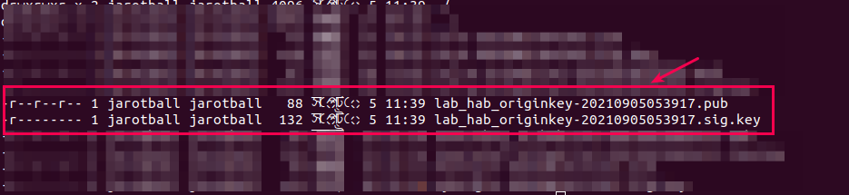

# Lab 15: Habitat Lab Environment Setup
Learning Objective:
- To install Chef Workstation and Chef Habitat for application delivery
- To create a new hab origin key= public + private key pair:: used to sign Habitat packages to prove their authenticity.
- To learn the purpose of hab origin key:: this is what makes packages immutable and build trust between built packages and the systems that run them.

### Step 01: Lab Setup
```bash
# 1.1 Check the hab version
> hab --version
hab 1.6.351/20210706202052

# 1.2 Create a new hab origin key named "lab_hab_originkey" 
# 1.2.1 Export the key
> export HAB_ORIGIN=lab_hab_originkey
> echo echo $HAB_ORIGIN

# 1.2.2 Generate the hab origin key
> hab origin key generate lab_hab_originkey         
---
» Generating origin key for lab_hab_originkey
★ Generated origin key pair lab_hab_originkey-20210905053917.

# 1.2.3 Verify that the keys are generated
> ll ~/.hab/cache/keys/
```

```bash
# 1.3 Check the docker and docker-compose version
> docker --version
Docker version 20.10.8, build 3967b7d

>  docker-compose --version
docker-compose version 1.29.2, build 5becea4c

# 1.4 Configure git
# 1.4.1 Check the git version
> git --version
git version 2.17.1

# 1.4.2 Configure git with username and email
> git config --global user.name "My Name"
> git config --global user.email myemail@example.com

```