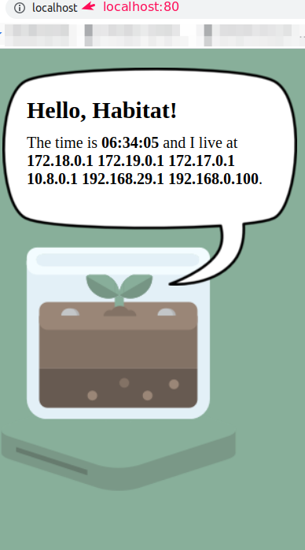
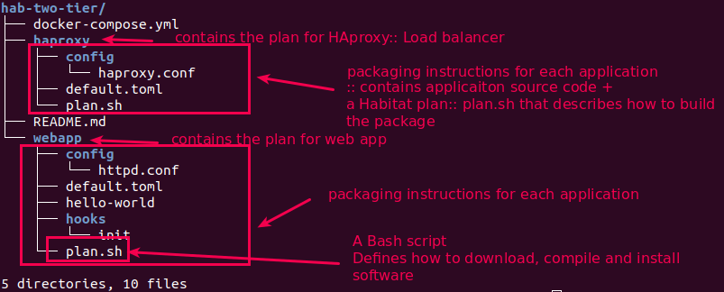
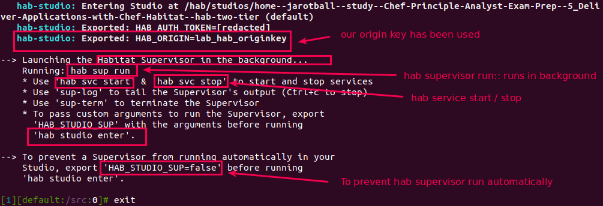
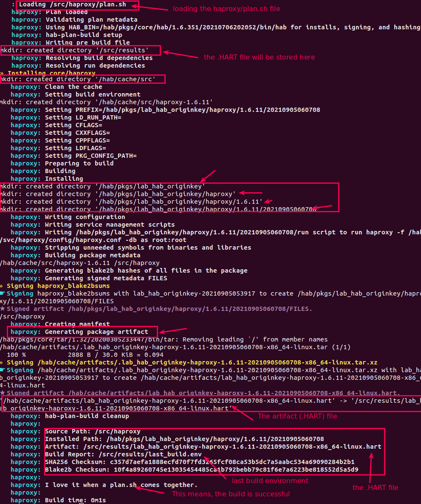
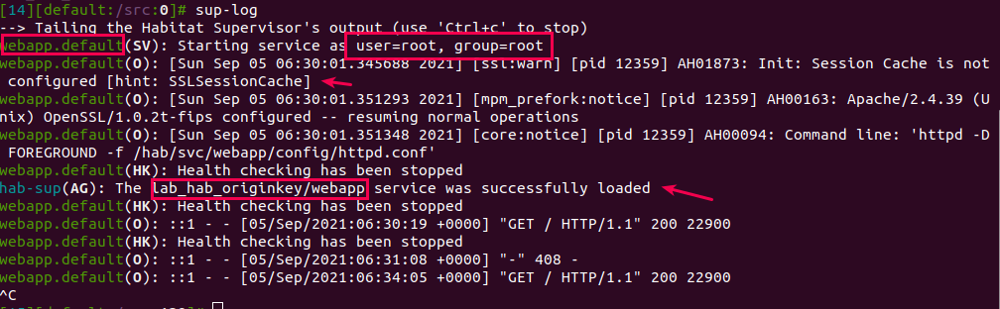
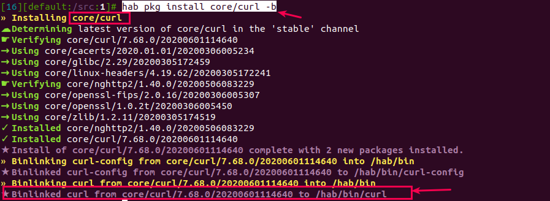

# Lab 16: Build, deploy and manage a basic web application from Habitat Clean Room and export the artifacts in Docker


### Step 01: Cloning the existing project from github and explore the project structure
```bash
# 1.1 Clone the application code
> git clone https://github.com/learn-chef/hab-two-tier.git

# 1.2 Check the project's structure
> tree hab-two-tier
```


### Step 02: Use of Habitat studio
- **Habitat Studio** is a development kit for creating automated build and deployment plans. 
- Studio packages these plans into an artifact (a .HART) file that can be tested directly inside of Studio's **clean room** environment.
- Clean Room --> means, the Studio is a minimal environment, where the smallest number packages are pre-installed.
- Studio is launched whenever the `hab studio enter` command is run and only the subdirectories below this namespace loaded into the environment.

```bash
# 2.1 Enter into the hab studio
> cd hab-two-tier
> hab studio enter
```

```bash
# 2.2 Lets see whats in the Studio
> [1][default:/src:0]# ls
README.md  docker-compose.yml  haproxy  webapp

# 2.3 Note that, hab studio runs in a <chroot> environment:: <Unix jail> or <chroot jail>
> [2][default:/src:0]# pwd
/src

# 2.4 Build the haproxy package
> [3][default:/src:0]# build haproxy
```

```bash
# 2.4.1 Check the build result (.HART and .env file) in results/
> [4][default:/src:0]# ll results/
---
-rw-r--r-- 1 1000 1000 3110 Sep  5 06:07 lab_hab_originkey-haproxy-1.6.11-20210905060708-x86_64-linux.hart
-rw-r--r-- 1 1000 1000  412 Sep  5 06:07 last_build.env

# 2.5 Build the webapp package
> [5][default:/src:0]# build webapp
---
   : Loading /src/webapp/plan.sh
   webapp: Plan loaded
   webapp: Validating plan metadata
   ... (Skipped)
   webapp: Source Path: /src/webapp
   webapp: Installed Path: /hab/pkgs/lab_hab_originkey/webapp/0.2.0/20210905061546
   webapp: Artifact: /src/results/lab_hab_originkey-webapp-0.2.0-20210905061546-x86_64-linux.hart
   webapp: Build Report: /src/results/last_build.env
   webapp: SHA256 Checksum: 307bc515ffbbdd4385521178fdf64e6f9509c071f1d2f6763dbee1d8e2abadc5
   webapp: Blake2b Checksum: 62ad6c31be0d38e7c3b9d95e7e07c227517944203650789cb69216e1c1b0bbbb
   webapp: 
   webapp: I love it when a plan.sh comes together.
   webapp: 
   webapp: Build time: 0m5s

# 2.5.1 Check the build result (.HART and .env file) in results/
> [7][default:/src:0]# ls results/
lab_hab_originkey-haproxy-1.6.11-20210905060708-x86_64-linux.hart  last_build.env
lab_hab_originkey-webapp-0.2.0-20210905061546-x86_64-linux.hart
```
## Your packages are now built! Remain in the Studio for now so we can test these packages in the clean room.

### Step 03: Deploy the .HART file directly within the Studio to see how a package will function without having to leave the cleanroom
- Habitat packages run under what's called the Supervisor.
- Supervisor as a process manager, much like PID 1 in Linux.
```bash
# 3.1 Disable your apache2 or nginx service (if running in localhost), 
# because hab svc load will use the port 80 and if localhost already have services running in port 80, then 
# hab supervisor will failed to start the loaded service
> sudo systemctl stop apache2
> sudo systemctl stop nginx

# 3.2 Check the hab supervisor status before loading any services
> [8][default:/src:0]# hab sup status                 
No services loaded.

# 3.3 Within hab studio cleanroom, load the webapp service
# use --force attribute if you want to reload the service
> [9][default:/src:0]# hab svc load $HAB_ORIGIN/webapp     # syntax:: hab <service> load <HAB ORIGIN KEY>/<ServiceName>  --force
The lab_hab_originkey/webapp service was successfully loaded

# 3.4 Check the hab supervisor status after loading the service
> hab sup status
package                                        type        desired  state  elapsed (s)  pid    group
lab_hab_originkey/webapp/0.2.0/20210905061546  standalone  up       up     10           12359  webapp.default

# 3.5 If you want to see the Supervisor log within Hab Studio, try below
> [10][default:/src:0]# sup-log
```

```bash
# 3.6 Verify that the webapp service is running at local machine (my machine) web browser
```

```bash
# 3.7 Test the site is running in Cleanroom environment
[11][default:/src:130]# curl -s 127.0.0.1 | grep 'The time is'
bash: curl: command not found         # See 'curl' command is not found, because Cleanroom has the minimal installation

# 3.7.1 Install the curl package in cleanroom for <core> origin with binlink to /hab/bin/curl so that its available from any directory
> hab pkg install core/curl -b
```

```bash
# 3.7.2 Test the site again within Cleanroom environment using <curl>
> [11][default:/src:0]# curl -s 127.0.0.1 | grep 'The time is'
The time is <strong>06:42:25</strong> and I live at <strong>172.18.0.1

```

> ### Our webapp is functioning! But remember that the curl package is only available to the current Studio session. 
> After you exit, the environment is destroyed and it won't be available to the next session. This is by design! 

### Step 04: Export the Habitat Artifact to Docker
```bash
# 4.1 verify the webapp HART artifact in results/
> [12][default:/src:0]# ll results/
total 36
-rw-r--r-- 1 1000 1000  3110 Sep  5 06:07 lab_hab_originkey-haproxy-1.6.11-20210905060708-x86_64-linux.hart
-rw-r--r-- 1 1000 1000 26698 Sep  5 06:15 lab_hab_originkey-webapp-0.2.0-20210905061546-x86_64-linux.hart
-rw-r--r-- 1 1000 1000   406 Sep  5 06:15 last_build.env

# 4.2 Export the webapp .HART artifact in docker using results/.HART file
> [4][default:/src:0]# hab pkg export docker results/lab_hab_originkey-webapp-0.2.0-20210905061546-x86_64-linux.hart

# 4.2(Alternative) Export in docker using results/last_build.env
> [4][default:/src:0]# cat results/last_build.env                                                               
pkg_origin=lab_hab_originkey
pkg_name=webapp
pkg_version=0.2.0
pkg_release=20210905061546
pkg_target=x86_64-linux
pkg_ident=lab_hab_originkey/webapp/0.2.0/20210905061546
pkg_artifact=lab_hab_originkey-webapp-0.2.0-20210905061546-x86_64-linux.hart
pkg_sha256sum=307bc515ffbbdd4385521178fdf64e6f9509c071f1d2f6763dbee1d8e2abadc5
pkg_blake2bsum=62ad6c31be0d38e7c3b9d95e7e07c227517944203650789cb69216e1c1b0bbbb

> [5][default:/src:0]# source results/last_build.env 
> [6][default:/src:0]# hab pkg export docker results/$pkg_artifact

# 4.3 Export the haproxy .HART artifact in docker using results/.HART file
> [7][default:/src:0]# hab pkg export docker results/lab_hab_originkey-haproxy-1.6.11-20210905060708-x86_64-linux.hart 


# 4.3 Verify that the docker image created
> docker images|grep $HAB_ORIGIN
lab_hab_originkey/haproxy           1.6.11                  95f50dce2576   About a minute ago   211MB
lab_hab_originkey/haproxy           1.6.11-20210905060708   95f50dce2576   About a minute ago   211MB
lab_hab_originkey/haproxy           latest                  95f50dce2576   About a minute ago   211MB
lab_hab_originkey/webapp            0.2.0                   db5282e29018   13 minutes ago       433MB
lab_hab_originkey/webapp            0.2.0-20210905061546    db5282e29018   13 minutes ago       433MB
lab_hab_originkey/webapp            latest                  db5282e29018   13 minutes ago       433MB


```