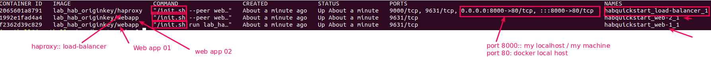

# Lab 17: Build, deploy and manage a basic web application that includes a load balancer, all from your workstation using Docker-Compose
> _Here we run a Docker Compose file that joins two web servers to load balancer and then you'll see the results in your browser._
> - **(8000:80 Binding)** The web servers listen for web traffic on port 80 on the internal network. 
> - External traffic to the load balancer is port-forwarded to port 8000 so that it doesn't conflict with any services you already have bound to port 80 on your workstation.


As an example, here's how each system in docker-compose.yml joins the network:
- **web-1** is created first. It does not specify a peer because it is the first member of the network.
- **web-2** is created second. It specifies web-1 as its peer.
- **load-balancer** is created third. It specifies web-2 as its peer (it could have also chosen web-1).

> A **rumor** is a piece of data that's shared with all the members of a ring. Habitat uses a gossip protocol to circulate rumors throughout the ring. 
> - For example, when a peer joins or leaves the network, a rumor is circulated among each Supervisor in the ring.

### Step 01: Inspect the docker-compose.yaml file


### Step 02: Launch the cluster
```bash
# 2.1 lunch the cluster into a new docker network named "habquickstart" (-p) in detached mode (-d)
> docker-compose -p habquickstart up -d
Creating network "habquickstart_default" with the default driver
Creating habquickstart_web-1_1 ... done
Creating habquickstart_web-2_1 ... done
Creating habquickstart_load-balancer_1 ... done

# 2.2 Check the docker network after creation of clsuter and search for the network <habquickstart>
> docker network ls
NETWORK ID     NAME                    DRIVER    SCOPE
f0daa563686f   bridge                  bridge    local
f23734e666d9   dokken                  bridge    local
18a678a89c2d   habquickstart_default   bridge    local      #<<-- Newly Created for our cluster
720fded740a2   host                    host      local
86bf880191c3   learn-inspec_default    bridge    local

# 2.3 Verify that the docker containers are running
> docker ps
```

```bash
# 2.4 Inspect the docker network <habquickstart> to verify web-01, web-02 and haproxy::loadbalancer
> docker network inspect habquickstart_default
```


```bash
# 2.5 Verify that the load balancer is loading the web application randomly from both web-1 and web-2
```


# Step 03: Build another webserver (web-03) and add this to the load balancer and check how the remour protocol works
```bash
# 3.1 Check the existing haproxy configuration file in loadbalancer
> docker exec habquickstart_load-balancer_1 cat /hab/svc/haproxy/config/haproxy.conf
---
global
    maxconn 32

defaults
    mode http
    timeout connect 5000ms
    timeout client 50000ms
    timeout server 50000ms

frontend http-in
    bind *:80
    default_backend default

backend default                             # Here we see, 2x servers are listed in the backend default section
    option httpchk GET /
    server 172.20.0.3 172.20.0.3:80         # web-01
    server 172.20.0.2 172.20.0.2:80         # web-02
    
# 3.2 Create a third web server and add this to our default docker network "habquickstart"
# peer this to web-01
# hab license:: accept-no-persist
# detached mode
# using image lab_hab_originkey/webapp 
> docker run --network=habquickstart_default --name web-3 --env HAB_LICENSE=accept-no-persist -d $HAB_ORIGIN/webapp --peer web-1
# Breakdown
#---------------------------------------------------------------------------------------------
# --network joins the container to the same network as your load balancer and web servers
# --name names the new container "web-3"
# --env passes in an environment variable to temporarily accept the habitat EULA
# -d runs the container in the background (detached)

# 3.3 Verify that the web-03 is created and running both in docker ps and docker network
> docker ps
```

```bash
> docker network inspect 
```

```bash
# 3.4 Verify that rumour protocol has worked: means the haproxy config file is updated with web-3 ip
> docker exec habquickstart_load-balancer_1 cat /hab/svc/haproxy/config/haproxy.conf
```


### Step 04: Verify that load balancer is redirecting to all three web servers and what if the web-3 is removed, how does he rumour protocol response?

```bash
> docker rm -f web-3
> docker ps 
> docker exec habquickstart_load-balancer_1 cat /hab/svc/haproxy/config/haproxy.conf
global
    maxconn 32

defaults
    mode http
    timeout connect 5000ms
    timeout client 50000ms
    timeout server 50000ms

frontend http-in
    bind *:80
    default_backend default

backend default
    option httpchk GET /
    server 172.20.0.3 172.20.0.3:80
    server 172.20.0.2 172.20.0.2:80   # See, web-3 ip: 172.20.0.5 is no longer available and rumour protocol has updated 
                                      # the haproxy configuration

```

### Step 05: Tearing Down and Cleaning up
```bash
# 5.1 Tear down the docker compose with its network
> docker-compose -p habquickstart down
---
Stopping habquickstart_load-balancer_1 ... done
Stopping habquickstart_web-2_1         ... done
Stopping habquickstart_web-1_1         ... done
Removing habquickstart_load-balancer_1 ... done
Removing habquickstart_web-2_1         ... done
Removing habquickstart_web-1_1         ... done
Removing network habquickstart_default

> docker ps
CONTAINER ID   IMAGE     COMMAND   CREATED   STATUS    PORTS     NAMES   # see no active container found

# 5.2 Remove the docker images 
> docker rmi 95f50dce2576 db5282e29018 -f   # -f:: force
```
