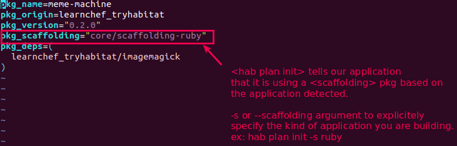

# Lab 18: Build a basic web application that creates animated GIFs.


## Learning Objective
- To write Habitat Plan that describe how to build and package the app.
- To build the Habitat package from the Studio and test it out.
- To export the Habitat package to a Docker container so you can access the app from the browser.
- To learn how scaffolding helps you quickly build packages for Ruby and other common application types.

> **Note**
> - The web application is written in Ruby (specifically, using Sinatra).
> - The web app uses ImageMagick to generate the animated GIF files 
> - and a Ruby gem called rmagick to connect the ruby code to ImageMagick.
> - The "core" origin is the set of foundational packages that are managed and versioned by the core Habitat maintainers.

### Step 01: Downloading the application from github and examining its structure
```bash
# 1.1 Fork the git repo and download it at local machine
> cd ~
> git clone git@github.com:jahidul-arafat/habitat-building-with-scaffolding.git
> cd habitat-building-with-scaffolding/

# 1.2 Examine the Ruby Application
> tree
```


### Step 02: Starting with the Hab Plan init
```bash
# Evey application you automate with Habitat will start with a Plan file. 
# Here in this example you will find the Plan file in (habitat/plan.sh)
# Plan file defines everything that's needed to build and package an application into a Habitat artifact (.HART file)
# Plan file is written in <Core Shell> language

# 2.1 Creates a Habitat plan for your core project <habitat-building-with-scaffolding>
# it will construct a cozy habitat for your app
# it will reuse habitat/plan.sh, habitat/default.toml and habitat/README.md
# It will create habitat/config/ which contains the configuration files for your app.
# it will create habitat/hook/ which contains automation hooks into your habitat
> export HAB_ORIGIN=lab_hab_originkey
> echo $HAB_ORIGIN
> hab plan init
```


### Q1. Why we are storing Habitat Manifest (habitat/plan.sh, habitat/default.toml, habitat/config/, habitat/hooks/) alongside our application code ?
- To make sure the automation travels with the application.
- All the instructions for building, deploying and managing the application live in a single source of truth that can be version controlled.

### Q2. Why to use Gemfile and config.ru ?

### Gemfile


### Rackup file (config.ru)


### Q3. What `hab plan init` tells to our application ?


### Step 03: Investigating the plan.sh file
```bash
# 3.1 Lets replace the habitat/plan.sh with the following contents and investigate its structure
> vim habitat/plan.sh

```


### Step 04: Operations in Clean room
- Changes in IDE is persistent with cleanroom environment
- The build at habitat studio will encounter an error on dependency::<RMagick 4.1.2>
```bash
# 4.1 Enter into the habitat studio, inspect its content and try to build the package
# This will import the origin key we created earlier and exported in $HAB_ORIGIN environment variable
> hab studio enter

```

```bash
# 4.1.1 Check whats inside the habitat studio
> [1][default:/src:0]# ls
Gemfile       README.md  coin.jpg  config.ru  imagemagick  results
Gemfile.lock  assets     coin.png  habitat    lib

# 4.1.2 Check the habitat plan file inside the cleanroom
> [2][default:/src:0]# cat habitat/plan.sh
pkg_name=meme-machine
pkg_origin=lab_hab_originkey
pkg_version="0.1.0"
pkg_scaffolding="core/scaffolding-ruby"

# 4.1.3 Build the package (by default it will build the package named habitat and will build from habitat/plan.sh)
# Note: You see that the build failed due to the rmagick Ruby gem.
# Why this has failed: bcoz it is unable to find a number of things required to install the <rmagick> gem
> [3][default:/src:0]# build
```


### Step 05: Debug the failed build and try to correct it with required dependency installed
- Habitat knows how to build your project and its explicit dependencies, but it cant discover implicit dependencies.
- For implicit dependencies,we need to provide these details in our plan.sh file
```bash
# 5.1 Inspect the rmagick dependency at github
https://github.com/rmagick/rmagick.git

# 5.2 Check whether we can find a pre-built package for imagemagick (from origin::<core>) at https://bldr.habitat.sh/
# Sign in with your github account
# searchkey: imagemagick

```


```bash
# 5.3 Add this package <imagemagick> in my app 
# at habitat/plan.sh using <pkg_deps> setting
> vim habitat/plan.sh
---
pkg_name=meme-machine
pkg_origin=lab_hab_originkey
pkg_version="0.1.0"
pkg_scaffolding="core/scaffolding-ruby"
pkg_deps=( core/imagemagick )
```

```bash
# 5.4 Enter into the STUDIO again and rebuild the package and check whether the error is resolved or not
# This time build will be successful
> hab studio enter
> [5][default:/src:0]# build
```

```bash
# 5.5 Check the package result in results/
# 2x files will be created: (a) a .HART file (artifact) and (b) last_build.env
> [6][default:/src:0]# ll results/
total 1576
-rw-r--r-- 1 1000 1000 1607202 Sep  6 10:56 lab_hab_originkey-meme-machine-0.1.0-20210906105601-x86_64-linux.hart
-rw-r--r-- 1 1000 1000     424 Sep  6 10:56 last_build.env
```

### Step 06: Investigating the .HART file

```bash
# 6.1 Find whats inside the .HART file we just created earlier
> [9][default:/src:0]# ll /hab/pkgs/lab_hab_originkey/meme-machine/0.1.0/20210906105601/
```


### Step 07: Load the installed package as habitat service inside the cleanroom
```bash
# 7.1 Load the service at cleanroom
> [2][default:/src:1]# hab svc load $HAB_ORIGIN/meme-machine --force # --force option for reload
```


