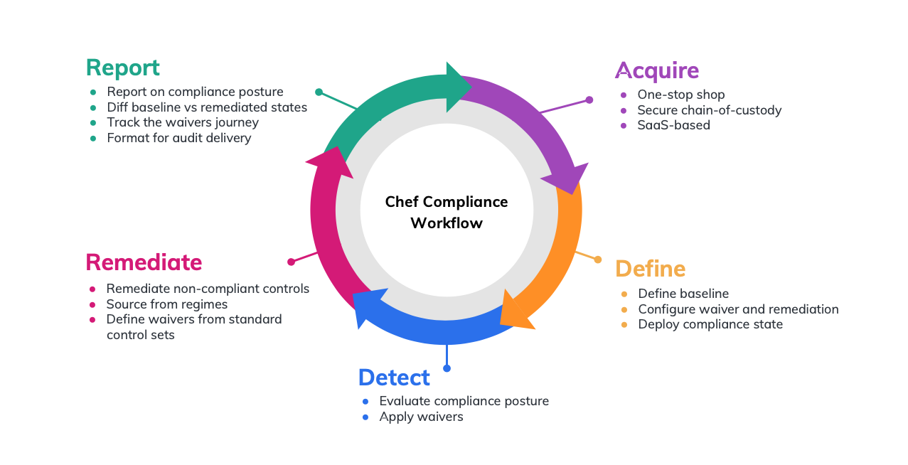

# Lab 20: 

The workflow defined with Chef Compliance represents an ongoing cycle:

Aquire -> Define -> Detect -> Remediate -> Report -> Aquire

Chef Compliance uses 
- Chef InSpec to author security controls, 
- Habitat to deploy them, and 
- Automate to visualize, monitor and export auditing results.

The result is a robust process that makes security an integral part of developing applications, deploying infrastructure, and provisioning environments.